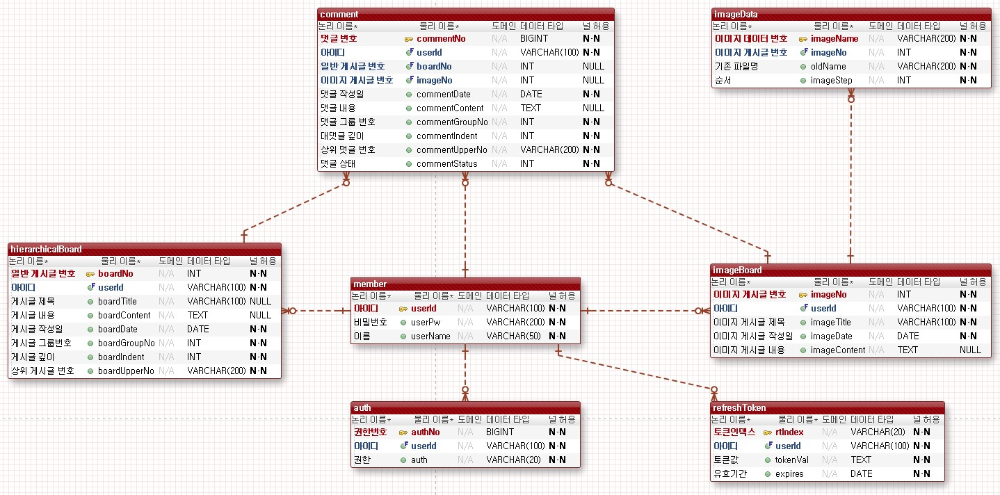

# REST API 프로젝트

---

# 목적
* BoardProject_JPA를 활용해 기능 추가보다는 REST-API를 만드는 것에 집중   
* API 서버와의 통신과 여러 클라이언트에 대응할 수 있도록 설계하고 개선하는 것에 대한 목표. 
* 동일한 서비스를 여러 클라이언트를 통해 제공할 수 있어야 한다는 전제하에 설계.
* 가장 기본적인 CRUD에 대한 기능을 포함하고 있는 프로젝트로 새로 학습한 내용이나 테스트에 활용하는 프로젝트.
* 가장 많이 활용하는 프로젝트인 만큼 여러 버전이 존재.
  * Spring, JSP, Oracle, MyBatis 기반 초기 버전
    * github : https://github.com/Youndae/BoardProject
  * Java Servlet & JSP, MySQL 기반의 버전
    * github : https://github.com/Youndae/BoardProject_servlet_jsp
  * Spring Boot, Spring Data JPA, MySQL 기반으로 REST-API 프로젝트의 기반이 된 버전.
    * 인증 / 인가 처리를 SpringSecurity로 처리하지 않았다는 점과 서버의 분리를 제외하고는 API 서버와 동일한 처리.

<br />

# 프로젝트 정보

<br />

## 구조
> * board-rest = RestAPI 서버
> * board-app = Application 서버
> * boardProject_client_react = Application 서버와 연결되지 않는 또 다른 클라이언트
>   * react github : https://github.com/Youndae/boardProject_client_react

<br />

## 사용 기술
* Application Server, API Server 공통
  * SpringBoot 2.7.6
  * Gradle
  * Java 1.8
  * Lombok
* API Server
  * SpringSecurity & JWT
  * Spring Data JPA
  * QueryDSL
* Application Server
  * JQuery(Ajax)
  * Thymeleaf
  * WebClient
* React
  * Axios
  * Redux
  * dayjs
* Front End 공통
  * BootStrap
* DataBase
  * MySQL
  * Redis

<br />

## 기능
* 이미지 게시판
  * 페이징
  * 검색(제목, 내용, 작성자, 제목+내용)
  * 게시글 등록(텍스트 + 이미지)
  * 게시글 수정 및 삭제
  * 상세 페이지 내 댓글(페이징)
* 계층형 게시판
  * 페이징
  * 검색(제목, 내용, 작성자, 제목+내용)
  * 게시글 등록(텍스트)
  * 게시글 수정 및 삭제
  * 상세 페이지 내 댓글(페이징)
* 사용자
  * 로그인
  * 회원가입

<br />

## ERD


<br />

## 기능

### 목차
* 인증 / 인가(JWT 설계와 관리 및 권한 관리)
* 인증 / 인가(filter와 토큰 검증)
* API 서버와의 통신
* 게시글 리스트 조회에서의 동적 쿼리(QueryDSL)

<br />

## 인증 / 인가(JWT 설계와 관리 및 권한 관리)   

인증 / 인가에 대한 처리는 JWT와 Spring Security를 통해 처리합니다.   
API 서버에 요청이 들어오면 Spring Security 설정에 따라 JwtAuthorizationFilter에 먼저 접근하게 되며 토큰 검증 후 정상적인 사용자라면 권한 관리를 위하 SecurityContextHolder에 인증 객체를 담습니다.   

하나의 서비스를 여러 클라이언트로 제공한다는 기획에 맞게 다중 디바이스에서의 로그인을 허용합니다.   
이때 토큰의 관리와 탈취에 대응하기 위해 식별자 개념의 ino라는 난수의 값을 만들어 클라이언트에게 같이 전달합니다.   
ino는 로그인 시 최초 생성되고 탈취로 판단되는 경우나 로그아웃을 하는 경우에만 삭제되도록 처리했습니다.   
ino는 로그인 시 토큰과 같이 응답 쿠키로 전달되며 클라이언트에서는 ino와 토큰 모두 쿠키에 저장합니다.   

토큰은 AccessToken과 RefreshToken 두개로 나눠 생성하고 관리하며 AccessToken은 1시간, RefreshToken은 2주의 만료기간을 갖습니다.   
두 토큰은 모두 사용자 아이디를 Claim으로 갖고 서로 다른 Secret key를 사용합니다.   
각 토큰은 RDB에는 저장하지 않고 Redis에 저장해 관리하게 됩니다.   
토큰 만료시간과는 상관없이 Redis에 저장되는 기간은 1달이며, 쿠키의 만료 기간 역시 1달로 설정했습니다.   
토큰의 만료시간과 다르게 긴 기간의 데이터 만료기간을 설정한 이유로는 탈취에 대응하기 위함이었습니다.   
사용자가 접속하지 않는 동안 탈취된 토큰으로 재발급을 받아 사용하는 경우를 고려해 추후 사용자가 페이지에 접근했을 때 값을 비교해 탈취를 판단할 수 있습니다.   

Redis의 키값으로는 토큰에 따라 at 또는 rt로 시작하며 이후 ino + 사용자 아이디 구조로 담아 사용자가 이후 접속했을 때 쿠키에 저장된 토큰 값과 Redis에 저장된 자신의 토큰값을 비교하는 것으로 탈취에 대응할 수 있습니다.   

<br />

JwtTokenProvider
```java
    @Value("#{jwt['token.access.secret']}")
    private String accessSecret;

    @Value("#{jwt['token.access.expiration']}")
    private Long accessTokenExpiration;

    @Value("#{jwt['token.refresh.secret']}")
    private String refreshSecret;

    @Value("#{jwt['token.refresh.expiration']}")
    private Long refreshTokenExpiration;

    @Value("#{jwt['redis.expirationDay']}")
    private Long redisExpirationDay;

    @Value("#{jwt['redis.accessPrefix']}")
    private String redisAccessPrefix;

    @Value("#{jwt['redis.refreshPrefix']}")
    private String redisRefreshPrefix;

    @Value("#{jwt['cookie.tokenAgeDay']}")
    private Long tokenCookieAge;

    @Value("#{jwt['cookie.inoAgeDay']}")
    private Long inoCookieAge;

    private final StringRedisTemplate redisTemplate;

    public void issuedToken(String userId, String inoValue, HttpServletResponse response) {
        String accessToken = issuedAccessToken(userId, inoValue);
        String refreshToken = issuedRefreshToken(userId, inoValue);

        //쿠키 생성 메소드 호출 (@Param accessToken, refreshToken, inoValue, response)
        setTokenToCookie(accessToken, refreshToken, response);
    }

    //ino까지 모두 생성
    public void issuedAllToken(String userId, HttpServletResponse response) {
        String inoValue = issuedIno();
        issuedToken(userId, inoValue, response);

        setInoToCookie(inoValue, response);
    }

    public String issuedAccessToken(String userId, String inoValue) {
        String accessToken = createToken(userId, accessSecret, accessTokenExpiration);
        String key = redisAccessPrefix + inoValue + userId;

        setRedisByToken(key, accessToken);

        return JwtProperties.TOKEN_PREFIX + accessToken;
    }

    public String issuedRefreshToken(String userId, String inoValue) {
        String refreshToken = createToken(userId, refreshSecret, refreshTokenExpiration);
        String key = redisRefreshPrefix + inoValue + userId;

        setRedisByToken(key, refreshToken);

        return JwtProperties.TOKEN_PREFIX + refreshToken;
    }

    public String issuedIno(){

        return UUID.randomUUID().toString().replace("-", "");
    }
    
    public String createToken(String userId, String secret, long expirationTime) {
        return JWT.create()
        .withSubject("cocoToken")
        .withExpiresAt(new Date(System.currentTimeMillis() + expirationTime))
        .withClaim("userId", userId)
        .sign(Algorithm.HMAC512(secret));
    }

    public void setRedisByToken(String key, String value) {
        ValueOperations<String, String> stringValueOperations = redisTemplate.opsForValue();
        stringValueOperations.set(key, value, Duration.ofDays(redisExpirationDay));
    }

    public void setTokenToCookie(String atValue, String rtValue, HttpServletResponse response) {

        response.addHeader("Set-Cookie"
                            , createCookie(
                            JwtProperties.ACCESS_HEADER_STRING
                            , atValue
                            , Duration.ofDays(tokenCookieAge)
                        ));

        response.addHeader("Set-Cookie"
                            , createCookie(
                            JwtProperties.REFRESH_HEADER_STRING
                            , rtValue
                            , Duration.ofDays(tokenCookieAge)
                        ));
    }

    public void setInoToCookie(String ino, HttpServletResponse response) {
        response.addHeader("Set-Cookie"
                            , createCookie(
                            JwtProperties.INO_HEADER_STRING
                            , ino
                            , Duration.ofDays(inoCookieAge)
                        ));
    }

    public String createCookie(String name, String value, Duration expires){
        return ResponseCookie
                .from(name, value)
                .path("/")
                .maxAge(expires)
                .secure(true)
                .httpOnly(true)
                .sameSite("Strict")
                .build()
                .toString();
    }
```

쿠키 옵션 설정으로는 secure, httpOnly, sameSite 설정을 했습니다.   
쿠키 생성은 클라이언트 또는 Application 서버에서 직접 제어하지 않도록 하기 위해 응답 헤더로 담아 보내는 방법으로 수정했습니다.   
여러 클라이언트가 존재하는데 각자 제어하도록 처리한다면 추후 수정이 발생할 때 여러 클라이언트를 수정해야 하기 때문에 한 곳에서 처리하는게 좋다고 생각했습니다.   

Redis는 RedisTemplate을 통해 사용했고, 토큰과 쿠키에 대한 secret key나 만료기간, prefix 같은 것은 jwt.properties 파일을 생성하고 그 안에서 관리합니다.

<br />

## 인증 / 인가(filter와 토큰 검증)

<br />

JwtAuthorizationFilter
```java
    @Override
    protected void doFilterInternal(HttpServletRequest request
            , HttpServletResponse response
            , FilterChain chain)
            throws IOException, ServletException {

        Cookie accessTokenCookie = WebUtils.getCookie(request, JwtProperties.ACCESS_HEADER_STRING);
        Cookie refreshTokenCookie = WebUtils.getCookie(request, JwtProperties.REFRESH_HEADER_STRING);
        Cookie inoCookie = WebUtils.getCookie(request, JwtProperties.INO_HEADER_STRING);
        //인증객체 생성시 필요한 사용자 아이디
        String username = null;

        if (inoCookie != null) {
            if (accessTokenCookie != null && refreshTokenCookie != null) { //모든 토큰이 존재
                if(!accessTokenCookie.getValue().startsWith(JwtProperties.TOKEN_PREFIX)
                        || !refreshTokenCookie.getValue().startsWith(JwtProperties.TOKEN_PREFIX)){
                    chain.doFilter(request, response);
                    return;
                }else {
                    String inoValue = inoCookie.getValue();
                    String claimByUserIdToAccessToken = jwtTokenProvider.verifyAccessToken(accessTokenCookie, inoValue);

                    //토큰 검증 과정에서 탈취 또는 잘못된 토큰이라는 응답이 반환되는 경우 클라이언트 쿠키가 삭제되도록 response에 담아 반환
                    if (claimByUserIdToAccessToken.equals(JwtProperties.TOKEN_STEALING_RESULT)
                            || claimByUserIdToAccessToken.equals(JwtProperties.WRONG_TOKEN)) {
                        deleteTokenCookieThrowException(response);
                        return;
                    } else if (claimByUserIdToAccessToken.equals(JwtProperties.TOKEN_EXPIRATION_RESULT)) { //AccessToken 만료 응답
                        claimByUserIdToAccessToken = jwtTokenProvider.decodeToken(accessTokenCookie);//accessToken 복호화
                        String verifyRefreshTokenResult = jwtTokenProvider.verifyRefreshToken(
                                                                refreshTokenCookie, inoValue, claimByUserIdToAccessToken
                                                            );//refreshToken 검증
                        // 복호화한 AccessToken과 refreshToken Claim이 일치한다면 재발급 수행
                        if (verifyRefreshTokenResult.equals(claimByUserIdToAccessToken)) {
                            jwtTokenProvider.issuedToken(claimByUserIdToAccessToken, inoValue, response);
                            username = claimByUserIdToAccessToken;//이후 인증객체 처리를 위해 사용자 아이디를 username 변수에 담아준다.
                        } else if (verifyRefreshTokenResult.equals(JwtProperties.TOKEN_STEALING_RESULT)
                                || verifyRefreshTokenResult.equals(JwtProperties.WRONG_TOKEN)) {
                            //일치하지 않는 경우 결과가 탈취로 반환. 탈취 또는 잘못된 토큰 응답이 반환되면 redis 데이터와 쿠키 삭제
                            deleteTokenAndCookieThrowException(claimByUserIdToAccessToken, inoValue, request, response);
                            return;
                        }
                    } else {
                        //AccessToken 검증 정상 응답
                        username = claimByUserIdToAccessToken;
                    }
                }
            } else if (accessTokenCookie == null && refreshTokenCookie == null) {
                chain.doFilter(request, response);
                return;
            } else {
                //토큰 두개중 하나만 존재하기 때문에 탈취로 판단.
                //두개 중 존재하는 토큰을 복호화하고 그 Claim 값을 통해 redis 데이터 삭제 및 쿠키 삭제
                String claimByUserId;
                if (accessTokenCookie != null)
                    claimByUserId = jwtTokenProvider.decodeToken(accessTokenCookie);
                else
                    claimByUserId = jwtTokenProvider.decodeToken(refreshTokenCookie);

                deleteTokenAndCookieThrowException(claimByUserId, inoCookie.getValue(), request, response);
                return;
            }
        }

        if (username != null) {
            Member memberEntity = memberRepository.findByUserId(username);
            CustomUser customUser = new CustomUser(memberEntity);
            Authentication authentication =
                    new UsernamePasswordAuthenticationToken(customUser, null, customUser.getAuthorities());

            SecurityContextHolder.getContext().setAuthentication(authentication);
        }

        chain.doFilter(request, response);
    }

    public void tokenStealingExceptionResponse(HttpServletResponse response) {
        response.setStatus(ErrorCode.TOKEN_STEALING.getHttpStatus());
        response.setContentType(MediaType.APPLICATION_JSON_VALUE);
        response.setCharacterEncoding("utf-8");
    }

    public void deleteTokenAndCookieThrowException(String tokenClaim
                                                    , String inoValue
                                                    , HttpServletRequest request
                                                    , HttpServletResponse response) {
        jwtTokenProvider.deleteToken(tokenClaim, inoValue, response);
        tokenStealingExceptionResponse(response);
    }

    public void deleteTokenCookieThrowException(HttpServletResponse response) {
        jwtTokenProvider.deleteTokenCookie(response);
        tokenStealingExceptionResponse(response);
    }
```

JwtAuthorizationFilter는 Security 설정에 따라 API 서버에 요청이 발생하면 요청을 가로채 토큰 검증을 먼저 수행합니다.   
Redis key 값으로 ino를 활용하는 만큼 ino의 유무를 먼저 판단하게 됩니다.   
ino가 존재하지 않는다면 Redis 데이터를 체크할 수 없기 때문에 토큰 검증이나 인증 객체 생성을 하지 않고 이후 처리를 진행합니다.   

ino가 존재한다면 여러가지 조건이 발생하게 됩니다.   
두 토큰이 모두 존재하는 경우, 둘다 없는 경우, 둘중 하나만 있는 경우를 가정할 수 있었습니다.   
두 토큰이 모두 존재한다면 토큰 검증을 수행하게 되고, 토큰 검증 과정에서 잘못된 토큰 혹은 Redis 데이터와 달라 탈취로 판단되는 경우가 발생한다면 예외처리를 하게 됩니다.   
또한, 두 토큰의 만료기간은 동일하기 때문에 하나의 토큰만 존재하는 것도 정상적인 요청이 아니라고 볼 수 있기 때문에 하나만 존재하는 경우에도 탈취라고 판단하도록 했습니다.   
이 경우 사용자 요청을 수행하지 않고 바로 오류 응답을 보내도록 했습니다.   
Filter에서는 ControllerAdvice Annotation을 통한 Exception Handling이 불가했기 때문에 응답 코드를 설정하고 doFilterInternal 내부에서는 return을 찍어 이후 처리를 진행하지 않고 클라이언트에 응답하도록 처리했습니다.   
예외 핸들링으로는 상황에 따라 Redis 데이터를 삭제하게 되며, 모든 쿠키를 삭제하도록 응답 쿠키에 담아 반환하게 됩니다.   

토큰이 만료된 경우에는 클라이언트로 만료 응답을 보내는 것이 아닌 체크 후 재발급을 바로 수행한 뒤 사용자 요청까지 처리하도록 구현했습니다.   
이 부분에 대해서 고민이 많았는데 대부분의 경우 여러번의 요청을 통해 처리하는 것을 확인할 수 있었습니다.   
요청 후 만료 응답을 받게 되면 재발급 요청을 보내 재발급을 받고 이후 사용자 요청을 다시 전송하는 형태를 주로 보게 되었는데 그럼 AccessToken이 만료되는 1시간 마다 한 번씩 3번의 요청을 보내야 된다는 결과가 나온다고 생각했습니다.   
그래서 이 요청 횟수를 줄여보고자 한번의 요청으로 토큰을 검증하고 재발급까지 수행할 수 있도록 구현해봤습니다.   

<br />

JwtTokenProvider
```java
    public String decodeToken(Cookie tokenCookie) {
        String tokenValue = tokenCookie.getValue().replace(JwtProperties.TOKEN_PREFIX, "");

        return JWT.decode(tokenValue)
                .getClaim("userId")
                .asString();
    }

    public String verifyAccessToken(Cookie accessToken, String inoValue) {
        String accessTokenValue = accessToken.getValue().replace(JwtProperties.TOKEN_PREFIX, "");
        String accessClaimByUserId = getClaimUserIdByToken(accessTokenValue, accessSecret);

        //잘못된 토큰인 경우 null이 반환될 것이고,
        //만료된 토큰이라면 Exception이 발생해 예외처리로 인해 TOKEN_EXPIRATION_RESULT가 반환된다.
        if (accessClaimByUserId == null)
            return null;
        else if(accessClaimByUserId.equals(JwtProperties.TOKEN_EXPIRATION_RESULT))
            return JwtProperties.TOKEN_EXPIRATION_RESULT;
        else if(accessClaimByUserId.equals(JwtProperties.WRONG_TOKEN))
            return JwtProperties.WRONG_TOKEN;

        String accessTokenKey = redisAccessPrefix + inoValue + accessClaimByUserId;
        String redisValue = getTokenValueData(accessTokenKey);

        if(accessTokenValue.equals(redisValue))
            return accessClaimByUserId;
        else {
            deleteTokenData(accessClaimByUserId, inoValue);
            return JwtProperties.TOKEN_STEALING_RESULT;
        }
    }

    public String verifyRefreshToken(Cookie refreshToken, String inoValue, String accessTokenClaim) {
        String refreshTokenValue = refreshToken.getValue().replace(JwtProperties.TOKEN_PREFIX, "");
        String refreshClaimByUserId = getClaimUserIdByToken(refreshTokenValue, refreshSecret);

        if(refreshClaimByUserId == null)
            return null;
        else if(refreshClaimByUserId.equals(JwtProperties.TOKEN_EXPIRATION_RESULT))
            return JwtProperties.TOKEN_EXPIRATION_RESULT;
        else if(refreshClaimByUserId.equals(JwtProperties.WRONG_TOKEN))
            return JwtProperties.WRONG_TOKEN;
        else if(!refreshClaimByUserId.equals(accessTokenClaim)) {
            deleteTokenData(refreshClaimByUserId, inoValue);
            return JwtProperties.TOKEN_STEALING_RESULT;
        }

        String refreshTokenKey = redisRefreshPrefix + inoValue + refreshClaimByUserId;
        String redisValue = getTokenValueData(refreshTokenKey);

        if(refreshTokenValue.equals(redisValue))
            return refreshClaimByUserId;
        else {
            deleteTokenData(refreshClaimByUserId, inoValue);
            return JwtProperties.TOKEN_STEALING_RESULT;
        }
    }

    public String getTokenValueData(String tokenKey) {
        long keyExpire = redisTemplate.getExpire(tokenKey);

        //Token이 존재하는데 -2라면 Redis 데이터가 만료되어 삭제된 것이기 때문에
        //null을 반환한다.
        if(keyExpire == -2)
            return null;

        return redisTemplate.opsForValue().get(tokenKey);
    }

//token에서 Claim으로 설정된 userId를 꺼내 반환.
    public String getClaimUserIdByToken(String tokenValue, String secret) {

        try {
            String claimByUserId = JWT.require(Algorithm.HMAC512(secret))
            .build()
            .verify(tokenValue)
            .getClaim("userId")
            .asString();
    
            return claimByUserId;
        }catch(TokenExpiredException e) {
            //토큰 만료 exception
            return JwtProperties.TOKEN_EXPIRATION_RESULT;
        }catch (JWTDecodeException e) {
            //비정상 토큰. 검증할 수 없는 토큰.
            return JwtProperties.WRONG_TOKEN;
        }
    }
```

Filter에서 토큰 검증을 요청했을 때 만료 응답을 받게 된다면 토큰을 복호화 해 Claim 값을 받아와 사용자 아이디를 반환받고 ino와 사용자 아이디를 통해 Redis 데이터와 비교하게 됩니다.   
만료되었지만 정상적인 토큰이라면 Redis 데이터와 일치할 것이기 때문에 그런 경우 재발급을 수행하고 다른 경우 탈취로 판단해 예외처리를 수행하도록 했습니다.   

<br />

## API 서버와의 통신

API 서버와의 통신 방법으로 Application Server에서는 WebClient를, react 클라이언트에서는 Axios를 택했습니다.   

<br />

ApplicationServer / WebClient
```java
@Component
public class WebClientConfig {
    public WebClient useWebClient(){

        return WebClient.builder()
                .baseUrl("http://localhost:9096")
                .defaultHeader(HttpHeaders.CONTENT_TYPE, MediaType.APPLICATION_JSON_VALUE)
                .build();
    }

    public WebClient useImageWebClient(){
        ExchangeStrategies exchangeStrategies = ExchangeStrategies.builder()
                .codecs(clientCodecConfigurer -> clientCodecConfigurer.defaultCodecs()
                        .maxInMemorySize(20 * 1024 * 1024)).build();

        return WebClient.builder()
                .baseUrl("http://localhost:9096")
                .defaultHeader(HttpHeaders.CONTENT_TYPE, MediaType.APPLICATION_JSON_VALUE)
                .exchangeStrategies(exchangeStrategies)
                .build();
    }
}


//ImageBoardWebClient
@Service
@RequiredArgsConstructor
@Slf4j
public class ImageBoardWebClient {

    private final WebClient webClient = new WebClientConfig().useWebClient();

    private final WebClient imageWebClient = new WebClientConfig().useImageWebClient();

    public Long patchBoard(long imageNo, String imageTitle, String imageContent
                            , List<MultipartFile> files, List<String> deleteFiles
                            , HttpServletRequest request, HttpServletResponse response){
        if(files != null && imageSizeCheck(files) == -2L)
            return -2L;

        MultipartBodyBuilder mbBuilder = new MultipartBodyBuilder();

        Optional.ofNullable(files)
                .orElseGet(Collections::emptyList)
                .forEach(file -> {
                    mbBuilder.part("files", file.getResource());
                });

        Optional.ofNullable(deleteFiles)
                .orElseGet(Collections::emptyList)
                .forEach(file -> {
                    mbBuilder.part("deleteFiles", file);
                });

        mbBuilder.part("imageTitle", imageTitle);
        mbBuilder.part("imageContent", imageContent);

        MultiValueMap<String, String> cookieMap = cookieService.setCookieToMultiValueMap(request);

        return imageWebClient.patch()
                .uri(uriBuilder -> uriBuilder.path(imagePath_variable).build(imageNo))
                .contentType(MediaType.MULTIPART_FORM_DATA)
                .body(BodyInserters.fromMultipartData(mbBuilder.build()))
                .cookies(cookies -> cookies.addAll(cookieMap))
                .exchangeToMono(res -> {
                    exchangeService.checkExchangeResponse(res, response);

                    return res.bodyToMono(Long.class);
                })
                .block();
    }
}


//ExchangeServiceImpl
    @Override
    public void checkExchangeResponse(ClientResponse res, HttpServletResponse response) {

        if(res.statusCode().equals(HttpStatus.OK)){
            cookieService.setCookie(res, response);
        }else if(res.statusCode().equals(HttpStatus.FORBIDDEN)){
            throw new CustomAccessDeniedException(ErrorCode.ACCESS_DENIED, "AccessDenied");
        }else if(res.rawStatusCode() == 800){
            //토큰 탈취
            cookieService.setCookie(res, response);
            throw new CustomTokenStealingException(ErrorCode.TOKEN_STEALING);
        }else if(res.statusCode().is4xxClientError()){
            throw new RuntimeException();
        }else if(res.statusCode().is5xxServerError()){
            throw new NullPointerException();
        }

    }
```

WebClient에 대한 기본 설정은 WebClientConfig에 작성해두고 필요한 곳에서 가져다 사용하도록 구현했습니다.   
이미지 파일 전송이 필요한 만큼 두개의 설정으로 분리해두었습니다.   
파일 전송 처리를 위해서 MultipartBodyBuilder를 통해 처리했고, 예외처리에 대해서는 ExchangeService 내에 메소드를  생성해 그 메소드를 호출하여 핸들링 하도록 처리했습니다.   
리팩토링 이전에는 응답에 대해 retrieve() 로 처리해 각각의 예외처리와 200 응답에 대한 처리를 수행했으나 API 서버에서 반환되는 응답 쿠키의 처리와 예외 핸들링을 직접 제어하기 위해 exchangeToMono()로 수정했습니다.   

<br />

React
```javascript
//customAxios.js
export const imageInsertAxios = axios.create({
  baseURL: `${default_url}${image_default}`,
  headers: {
    'Content-Type' : 'multipart/form-data',
  },
  withCredentials: true,
})

//ImageUpdatePage.jsx
const handleSubmit = async (e) => {
  e.preventDefault();

  let formData = setFormData(values, files);
  deleteImageName.forEach(
          fileName => formData.append('deleteFiles', fileName)
  );

  await imageInsertAxios.patch(`${imageNo}`, formData)
          .then(res => {
            navigate(`/image/${res.data}`);
          })
          .catch(err => {
            axiosErrorHandling(err);
          })
}
```

React에서는 Spring Application에서 보다 간단하게 처리할 수 있었습니다.   
Axios를 모듈화 해두었기 때문에 해당 모듈을 그대로 가져와 사용했으며 FormData에 담아 전송하는 것으로 간단하게 처리할 수 있었습니다.   
react에서도 API 서버 요청에서 발생하는 예외 핸들링을 Application Server 처럼 모듈화 해 관리하도록 했습니다.  

<br />

## 게시글 리스트 조회에서의 동적 쿼리(QueryDSL)

REST-API로 구현하던 당시에는 JPQL만 사용하고 있었습니다.   
insert, update, delete 요청에 대한 동적 쿼리는 List를 넘겨 in 절로 처리하는 방법으로 처리할 수 있었으나 검색어 여부와 검색 타입에 따른 조건에 대한 처리는 서비스단에서 조건문으로 나눈 뒤 해당 메소드들을 호출하도록 처리했습니다.   
그렇지만 코드가 너무 길어지고 중복되는 부분이 많이 발생했기 때문에 이 부분을 개선하고자 방법을 찾아보게 되었습니다.   
그리고 그 결과 QueryDSL을 통한 동적쿼리로 이 부분을 개선할 수 있었습니다.

<br />

수정 이전 코드 - HierarchicalBoardServiceImpl, HierarchicalBoardRepository
```java
    @Override
    public Page<HierarchicalBoardDTO> getHierarchicalBoardList(Criteria cri) {
        Page<HierarchicalBoardDTO> dto;

        if (cri.getKeyword() == null || cri.getKeyword() == "") { //default List
            dto = hierarchicalBoardRepository.hierarchicalBoardList(
                          PageRequest.of(cri.getPageNum() - 1
                          , cri.getAmount()
                          , Sort.by("boardGroupNo").descending()
                                  .and(Sort.by("boardUpperNo").ascending()))
                    );
        } else if (cri.getSearchType() == "t") {//title 검색시 사용
        dto = hierarchicalBoardRepository.hierarchicalBoardListSearchTitle(
                          cri.getKeyword()
                          , PageRequest.of(cri.getPageNum() - 1
                          , cri.getAmount()
                          , Sort.by("boardGroupNo").descending()
                                  .and(Sort.by("boardUpperNo").ascending()))
                    );
        } else if (cri.getSearchType() == "c") {//content 검색시 사용
        dto = hierarchicalBoardRepository.hierarchicalBoardListSearchContent(
                          cri.getKeyword()
                          , PageRequest.of(cri.getPageNum() - 1
                          , cri.getAmount()
                          , Sort.by("boardGroupNo").descending()
                                  .and(Sort.by("boardUpperNo").ascending()))
                    );
        } else if (cri.getSearchType() == "u") {// user 검색 시 사용
        dto = hierarchicalBoardRepository.hierarchicalBoardListSearchUser(
                          cri.getKeyword()
                          , PageRequest.of(cri.getPageNum() - 1
                          , cri.getAmount()
                          , Sort.by("boardGroupNo").descending()
                                  .and(Sort.by("boardUpperNo").ascending()))
                    );
        } else if (cri.getKeyword() == "tc") {// title and content 검색시 사용
        dto = hierarchicalBoardRepository.hierarchicalBoardListSearchTitleOrContent(
                          cri.getKeyword()
                          , PageRequest.of(cri.getPageNum() - 1
                          , cri.getAmount()
                          , Sort.by("boardGroupNo").descending()
                                  .and(Sort.by("boardUpperNo").ascending()))
                    );
        } else {
            return null;
        }

        return dto;
    }
    
    //repository
    //HierarchicalBoard default List
    @Query(value = "SELECT new com.example.boardrest.domain.dto.HierarchicalBoardDTO(" +
            "b.boardNo" +
            ", b.boardTitle" +
            ", b.member.userId" +
            ", b.boardContent" +
            ", b.boardDate" +
            ", b.boardGroupNo" +
            ", b.boardIndent" +
            ", b.boardUpperNo) " +
            "FROM HierarchicalBoard b"
        , countQuery = "SELECT c.contentCount " +
            "FROM Count_table c " +
            "WHERE c.boardName = 'hierarchicalboard'")
    Page<HierarchicalBoardDTO> hierarchicalBoardList(Pageable pageable);


    //HierarchicalBoard searchTitle List
    @Query(value = "SELECT new com.example.boardrest.domain.dto.HierarchicalBoardDTO(" +
          "b.boardNo" +
          ", b.boardTitle" +
          ", b.member.userId" +
          ", b.boardContent" +
          ", b.boardDate" +
          ", b.boardGroupNo" +
          ", b.boardIndent" +
          ", b.boardUpperNo) " +
          "FROM HierarchicalBoard b " +
          "WHERE b.boardTitle LIKE :keyword"
        , countQuery = "SELECT count(b) " +
          "FROM HierarchicalBoard b " +
          "WHERE b.boardTitle LIKE :keyword")
    Page<HierarchicalBoardDTO> hierarchicalBoardListSearchTitle(@Param("keyword") String keyword, Pageable pageable);
```

여기서 Criteria는 DTO로 사용하는 직접 만든 객체입니다.   
페이지 번호, 각 게시판의 한 페이지당 출력 데이터 개수, 검색어, 검색 타입을 필드로 갖고 있습니다.
기존에는 이렇게 모든 조건에 대해 Repository에 JPQL로 직접 작성하고 Service에서도 조건문들 통해 다르게 처리하도록 했습니다.
이 부분에 대해 QueryDSL을 적용하면서 동적으로 가독성 높게 수정할 수 있었습니다.   

<br />

개선된 코드
```java
    //HierarchicalBoardServiceImpl
    @Override
    public ResponsePageableListDTO<HierarchicalBoardListDTO> getHierarchicalBoardList(Criteria cri, Principal principal) {

        Pageable pageable = PageRequest.of(cri.getPageNum() - 1
                                          , cri.getBoardAmount()
                                          , Sort.by("boardGroupNo").descending()
                                                    .and(Sort.by("boardUpperNo").ascending()));

        Page<HierarchicalBoardListDTO> listDTO = hierarchicalBoardRepository.findAll(cri, pageable);
        ResponsePageableListDTO<HierarchicalBoardListDTO> responseDTO = new ResponsePageableListDTO<>(listDTO, principal);

        return responseDTO;
    }

    //customRepository
    public interface HierarchicalBoardRepositoryCustom {
      Page<HierarchicalBoardListDTO> findAll(Criteria cri, Pageable pageable);
    }
    
    //customRepositoryImpl
    @Repository
    @RequiredArgsConstructor
    public class HierarchicalBoardRepositoryCustomImpl implements HierarchicalBoardRepositoryCustom{

      private final JPAQueryFactory jpaQueryFactory;

      @Override
      public Page<HierarchicalBoardListDTO> findAll(Criteria cri, Pageable pageable) {

        List<HierarchicalBoardListDTO> list = jpaQueryFactory.select(
                        Projections.fields(
                                HierarchicalBoardListDTO.class
                                , hierarchicalBoard.boardNo
                                , hierarchicalBoard.boardTitle
                                , hierarchicalBoard.member.userId
                                , hierarchicalBoard.boardDate
                                , hierarchicalBoard.boardIndent
                        )
                )
                .from(hierarchicalBoard)
                .where(
                        searchTypeEq(cri.getSearchType(), cri.getKeyword())
                )
                .orderBy(hierarchicalBoard.boardGroupNo.desc())
                .orderBy(hierarchicalBoard.boardUpperNo.asc())
                .offset((cri.getPageNum() - 1) * cri.getBoardAmount())
                .limit(cri.getBoardAmount())
                .fetch();

        JPAQuery<Long> count = jpaQueryFactory.select(hierarchicalBoard.countDistinct())
                .from(hierarchicalBoard)
                .where(
                        searchTypeEq(cri.getSearchType(), cri.getKeyword())
                );

        return PageableExecutionUtils.getPage(list, pageable, count::fetchOne);
      }

      private BooleanExpression searchTypeEq(String searchType, String keyword) {
        if(searchType == null)
          return null;
        else if(searchType.equals("t"))
          return hierarchicalBoard.boardTitle.like(keyword);
        else if(searchType.equals("c"))
          return hierarchicalBoard.boardContent.like(keyword);
        else if(searchType.equals("tc"))
          return hierarchicalBoard.boardTitle.like(keyword).or(hierarchicalBoard.boardContent.like(keyword));
        else if(searchType.equals("u"))
          return hierarchicalBoard.member.userId.like(keyword);
        else
          return null;
      }
    }
```

검색어와 검색 타입에 대한 동적 처리는 BooleanExpression 타입의 searchTypeEq을 통해 처리할 수 있었습니다.   
QueryDSL을 사용하면서 정말 좋았던 점이 기본적으로 세팅만 해두고 나면 쿼리 작성에 대해 직관적으로 표현되기 때문에 여러가지로 알아볼 필요 없이 처리가 가능하다는 점이었습니다.   
또한 JPQL 처럼 count 쿼리를 직접 제어할 수 있다는 점이 좋았습니다.   

현재 데이터베이스에는 테스트를 위해 100만건의 더미데이터를 넣어두었습니다.   
데이터가 쌓여 갈수록 어느정도의 시간이 소요되는지, 그럼 쿼리를 어떻게 작성하고 개선할 수 있는지 확인하기 위해 넣어두었는데 기존 count(*)로 처리했던 쿼리의 경우 100만건 만으로도 16초가 소요되었습니다.   
여러 테스트를 통해 count(distinct(PK)) 로 조회하는 것이 전체 조회에서는 0.6초로 개선될 정도로 확연한 차이를 보이는 것을 확인할 수 있었습니다.   
하지만 LIKE 문을 통해 WHERE문이 존재하는 경우에는 count(*)가 조금 더 빠른 결과를 보여줬고, 검색되는 컬럼에 대해 인덱스를 설정해주는 것으로 처리 시간을 더 단축 할 수 있다는 결과를 확인할 수 있었습니다.   
그래서 꼭 count 쿼리를 제어했으면 했고, QueryDSL은 제가 기획한 프로젝트의 요구사항을 잘 처리할 수 있는 좋은 방법이었습니다.

<br />

## 느낀점과 고민중인 부분
REST-API 버전의 프로젝트를 진행하고 마무리할 때 까지는 리스트 형태의 데이터 처리를 반복문으로 처리했습니다.   
프로젝트를 처음 마무리한 뒤 이후 학습 중에 서버 또는 데이터 베이스의 접근 비용 또는 효율에 대한 글을 보게 되었습니다.   
미처 생각하지 못한 부분이었는데 여러 번 접근해 처리한다는 것은 그만큼의 서버 트래픽 또는 Thread pool 관리에서 비효율적이라는 생각이 들었습니다.   
그래서 여러 건의 데이터 처리에 대해 처리할 방법을 알아보게 되었고 동적 쿼리로 개선하게 되었습니다.   
리스트 형태는 in 절로 간단하게 해결할 수 있었지만 조회 조건에 대한 문제는 그렇게 해결할 수 없었기 때문에 QueryDSL을 사용했습니다.   
JPQL로만 처리했었는데 QueryDSL을 써보니 가독성이 좋아 바로바로 이해하고 쿼리 작성을 쉽게 처리할 수 있었습니다.   
또한 컴파일 과정에서 실수를 잡아낼 수 있다는 점에서도 유리하다고 느꼈습니다.   

개선하고자 고민하는 부분으로는 Redis의 활용입니다.   
토큰 관리를 Redis로 처리하고 있는데 다중 로그인을 허용하게 되면서 한 명의 사용자에 대한 토큰 데이터가 다수 존재합니다.   
고민하고 있는 부분이 이 데이터 관리에 대한 부분인데 같은 사용자의 데이터를 묶어서 관리할 수 있는지, 할 수 있다면 묶는 것이 좋을지 지금처럼 개별적인 데이터로 관리하는 것이 더 좋을지에 대한 부분입니다.   
추후 Redis를 통한 캐싱 처리도 적용해보고자 하고 있기 때문에 데이터 관리를 어떻게 처리할지 고민하고 있습니다.   
이 부분에 대해서 Redis를 더 학습해서 개선하고자 계획하고 있습니다.   


<br />
<br />

---

<br />

# History
> 22/12/29 - Api Server
>> 전체적인 기능 코드 작성.   
>> 현재 누락 코드는 각 Entity Service에서 getList 코드들.   
>> 기존 프로젝트를 그대로 사용하는것이기 때문에 딱히 문제는 없을것이라고 가정하고   
>> 기존 프로젝트와 다른 getList 기능들 먼저 구현해서 테스트 필요.   
>> getList 테스트가 완료되면 전체적인 기능 테스트 필요.
>
> #
> 23/01/04 - Api Server
>> 계층형 게시판 List 리턴 처리 완료.   
>> 데이터는 DTO로 매핑해 받고 이를 리턴하는 형태로.   
>> 문제점으로는 Paging에 대한 데이터를 어떻게 처리할것인가가 문제.   
>> DTO에 PageDTO를 추가해봤지만 그렇게 되면 쿼리 실행시에 SyntaxError가 발생.   
>> 생각난 방법 중 하나는 리스트 페이지 접근시에 여기에서는 게시판 데이터만 가져가고
>> PageController를 만들어서 거기서 한번 더 처리하는 형태가 생각나긴 했으나
>> 그럼 count 쿼리가 두번 발생한다는 점에서 성능 저하가 우려.   
>> 기존 코드 그대로 사용하면 그것도 어차피 count 쿼리를 두번 사용하긴 하는데   
>> 아무래도 count 쿼리가 지금 많이 느리게 동작하는 상황이므로 중간에 지연이 많이 발생할것으로 보임.   
>> 1차적으로 paging 데이터를 어떻게 넘길것인가를 처리하고
>> count 쿼리에 대한 점을 좀 더 수정해야할 필요가 있음.   
>> 남은 이미지 게시판과 댓글 역시 DTO로 매핑해 처리하도록 수정필요.
>> 일단은 계층형 게시판 먼저 문제 해결할것.
>
> #
> 23/01/05 - Api Server
>> 계층형 게시판 List 리턴 처리 문제 해결.
>> HierarchicalBoardListDTO를 하나 더 만들어서 그 안에서 HierarchicalBoardDTO와 PageDTO를 필드로 갖도록 해 처리.   
>> HierarchicalBoardDTO 내에서 처리를 하고자 하면 이 DTO 자체가 List화 되기 때문에 PageDTO를 담아줄 방법이 없었음.   
>> 그것을 해결하기 위해 MultiValueMap으로 변환해 거기에 PageDTO 데이터를 추가하는 방법을 생각했지만 뜻대로 되지 않았고   
>> 구글 검색 결과 보통 요청을 받을 때 MultiValueMap으로 받지 리턴을 MultiValueMap으로 하지는 않는것 같다고 판단해 해결 방법이 아니라고 생각.   
>> 다음으로 생각한 방법이 PageDTO에 HierarchicalBoardDTO를 List로 만들어두고 생성자를 통해 가져온 데이터를 추가하는 방법.   
>> 이 방법은 정상적으로 데이터를 넘겨주기는 했으나 PageDTO 데이터가 쭉~ 나오고 그다음 DTO List 데이터가 나와 데이터가 정리가 전혀 되지 않은 느낌이었고   
>> 이걸 처리하고자 한다면 하긴 하겠지만 문제는 PageDTO는 댓글에서 역시 사용해야 하는 페이징 기능이고 추후 이미지 게시판에 페이징을 적용하게 된다면
>> 그 모든 엔티티들을 다 PageDTO에 받아서 처리하도록 하기에는 무리가 있다고 판단.   
>> 다른 방법으로 HierarchicalBoardDTO에 데이터를 매핑하는것이 아닌 HierarchicalBoard Entity에 받아온 다음 DTO에서는 이 엔티티를 List로 받아오고
>> PageDTO를 갖고 있도록 하는 방법.   
>> 이 방법의 문제점으로는 stackOverFlow가 발생한다는 문제.   
>> '양방향이 꼭 필요한 경우가 아니라면 oneToMany는 지양하는것이 좋다' 라는 의견에 Member Entity에서 각 게시판과 댓글 entity의 OneToMany를 모두 끊었으나
>> Auth Entity와는 양방향이 필요하다고 판단했기에 이걸 끊어낼 수 없었는데 여기서 StackOverFlow가 발생해서 해결이 안되는 상황.
>> @ToString.Exclude로 해결하고자 했으나 그것 역시 안되었고 이건 JPA 연관관계에 대한 지식 부족 문제라고 생각함.   
>> 추후 이 방법에 대해서는 추가적인 학습이 필요. 그리고 또 한가지 문제점으로 불필요하게 사용자 아이디를 제외한 나머지 정보까지 다 가져왔기 때문에 패스.   
>> 마지막 방법이 HierarchicalboardListDTO.   
>> 너무 많은 DTO를 만들어서 처리하는것이 아닌가 싶긴 했지만 어차피 게시판 상세 페이지 정보를 위해서는 페이징 기능이 필요없는 HierarchicalBoardDTO와 분리하는것도
>> 괜찮은 방법이라고 생각했기 때문에 이 방법으로 해결.
>> #
>> 추가로 count 쿼리에 대한 문제도 해결.   
>> 여기저기 찾아본 것으로는 페이징을 위해 전체 데이터 개수를 조회할 때 대략적인 개수만 가져와서 처리하는 방법과
>> 데이터의 총 개수를 담고 있는 테이블을 별도로 생성해 처리하는 방법 두가지가 보편적인 해결 방안으로 언급되었다.   
>> index를 생성해 처리하는것도 얘기가 많이 나왔지만 테이블 전체를 조회하다보니 이것도 의미가 없었고 대략적인 개수를 가져와 처리한다는 것은
>> google 검색의 기능을 예로 들어서 설명해주신 것을 봤지만 자세한 설명도 아니었고 '아 이런 형태구나' 이정도만 이해가 갈 뿐 어떻게 구현해야 할지
>> 감이 잡히지 않아 패스. 그래서 count_table이라는 테이블을 생성 후 그 안에서 boardName을 PK로 전체 데이터 개수가 필요한 hierarchicalBoard 테이블과
>> imageBoard 테이블만 넣어 전체 개수를 처리.   
>> 그리고 trigger를 설정해 insert, delete 시에 개수가 조절되도록 수정.   
>> 이걸 Entity로 굳이 만들어야 할까 싶었지만 JPA에서 table과 Entity의 구조는 맞춰야 하는것 아닌가 해서 생성.
>> #
>> comment 수정중
>
> #
> 23/01/06 - Api Server
>> Comment 수정.   
>> Page<>로 페이징 관련 데이터를 넘길 수 있다는 것을 확인. 그래서 리턴을 List 로 하는것이 아닌 Page로 리턴하도록 수정.   
>> DTO에 매핑할 때 null값이 존재하면 오류가 발생하면서 매핑이 안되는 부분때문에 각 게시판별 DTO를 생성하고
>> 이 DTO들을 Page 타입으로 담고 있는 CommentListDTO를 만들어 해당하지 않는 게시판의 DTO는 null값으로 만들어 리턴하도록 구현.   
>> 그리고 HierarchicalBoard 역시 ListDTO를 삭제하고 DTO하나만 Page 타입으로 리턴하도록 해 처리.   
>> 프론트에서는 totalElements와 totalPages가 같이 리턴되니까 이걸 받아서 데이터 하단에 페이지 이동 처리만 하도록 하면 되니 PageDTO는 삭제.
>> #
>> url은 rest에 맞게 전체적으로 수정이 필요.   
>> imageBoard에 대한 처리 필요.
>
> #
> 23/01/10 - Api Server
>> ImageBoard 처리 수정.   
>> image-board-list는 정상적으로 리턴하는것을 확인.   
>> image-detail과 image-modify는 따로 분리해서 처리하고는 있으나 동일한 repository 메소드를 가져와 사용중.   
>> 이 처리를 위해 ImageDetailDTO를 생성.   
>> detail과 modify는 동일한 데이터를 리턴하고 있으나 프론트에서 요청하는것을 감안해 지금처럼 분리하는것이 나은지
>> 아니면 동일하게 detail로만 받아서 처리하도록 할것인지 고민.   
>> 이제 전체적인 구현은 끝난것으로 보이고 ApplicationServer 만들어서 테스트 해볼것.
>
> 
> 23/02/10 - Client Server
>> WebClient로 api Server로 데이터 요청 처리 구현.
>
> 23/02/11 ~ 23/02/28 - Client Server
>> SpringSecurity 단일로 api에서 인증 인가 처리가 이해가 안되는 문제로 SpringSecurity + JWT 로 전환.   
>> SpringSecurity에서 /login 요청을 가로채 처리하도록 AuthenticationFilter를 구현했으나 
>> Client Server로 토큰을 리턴하도록 하는 방법을 찾지 못해 
>> 로그인 요청을 /member/login 으로 받아 member 서비스단에서 직접 처리한 후 토큰 생성하고 토큰을 리턴하도록 구현.      
>> 그로 인해 AuthenticationFilter가 불필요해져 삭제 예정.   
>> AccessToken(At)과 RefreshToken(Rt) 두가지 토큰을 생성하고 처리하도록 구현.      
>> At은 1시간의 만료기간. Rt은 2주의 만료기간을 설정.   
>> At가 만료되어 Rt를 통해 재발급을 받는 경우 Rt 역시 재발급 받도록 구현.      
>> Rt는 DB에 저장하고 At, Rt 모두 Client Server에 리턴해 Client에서는 쿠키에 두가지 토큰을 보관.   
>> localStorage에 보관하지 않은 이유로는 XSS 공격을 방어하기 위해서이며 Cookie에서 발생할 수 있는 문제인 csrf 공격을 막기 위해 
>> Client Server에서 쿠키 생성 시 HttpOnly, Secure, same-site를 설정.   
>> 또한 인터셉터에서 referer를 체크하도록 해 혹시나 뚫고 들어오더라도 한번 더 체크해 방지할 수 있도록 구현 필요.   
>> At Cookie의 경우 만료 시간이 1분 작게 설정.   
>> Api Server에 요청하는 시점이 토큰 만료시점과 겹치는 경우 문제가 발생할 수 있기 때문에 Client에서 사전에 처리할 수 있도록 하기 위함.   
>> 아직 부족해서 처리하지 못한점이 XSS 방지.   
>> XSS의 경우 HttpOnly로 다 막을수는 있다고 하지만 마냥 안심할 수 없는 부분이 만약 내 도메인 내의 게시글에 스크립트를 삽입하는 경우 
>> same-site 설정과 referer를 뚫고 들어올 수 있다고 판단해 게시글에 스크립트 삽입이 불가하도록 설정해야할 필요성이 있다고 생각함.   
>> 이건 꼭 학습해서 처리해야 하는 부분.
>
> 23/03/01 ~ 23/03/03 - Client Server
>> TokenInterceptor로 referer 체크하도록 일단 추가만 처리.   
>> interceptor 처리와 여기서 발생하는 Exception 처리는 모든 구현이 끝난 후에 마지막에 구현.   
>> 초기 기능 구현 당시 At 하나만 갖고 있도록 구현했기 때문에 해당 부분들 Rt를 같이 갖고 있도록 수정.   
>> At가 만료된 경우 Rt를 Api Server에 보내 재발급 받은 후 데이터 요청을 하도록 수정.
>
> 23/03/06 ~ 23/03/07
>> api 서버의 AuthorizationFilter에서 TokenProvider에 접근하지 못하는 문제 발생.   
>> nullpointerException이 발생했는데 Filter의 constructor에 TokenProvider를 추가해주고 
>> 필터를 등록해둔 SecurityConfig에도 같이 추가해줌으로써 해결.   
>> 당연히 @Component 달고 @Autowired를 달아주면 주입이 될거라고 생각을 했으나 전혀 주입 받지 못하는 상태였던 것.   
>> 이런 경우에는 생성자를 통한 주입으로 처리를 해야 정상적으로 동작한다.
>>
>> 사용자 로그인 정보 처리 구현.   
>> 계속 고민했으나 로그인 여부는 RefreshToken을 localStorage에 넣어두고 이 토큰 소지 여부로 파악 할 수 있다고 쳐도 
>> 게시판 상세페이지같은 곳에서 작성자와 사용자 아이디를 비교하는 경우에는 이 방법이 불가하다고 판단 함.   
>> 그래서 api에서 데이터를 받을 때 게시글 데이터와 사용자의 아이디를 같이 받는 형태로 구현.   
>> 클라이언트 서버에서는 세션을 전혀 사용하지 않고 있고 api 서버에서 그나마 권한관리로 인해 세션을 사용중인데 
>> 이 문제점이 딱히 검색해서도 나오는 방법이 없었고 생각해본 방법은 세가지.   
>>> 1. Spring Security를 사용중이니 클라이언트 서버에 세션을 만들어 사용자 정보(아이디, 닉네임 정도)를 관리.
>>> 2. api 서버에서 요청 데이터를 리턴할 때 사용자 아이디를 같이 리턴.
>>> 3. 2번 처럼 처리하는데 리턴할 때 사용자 아이디를 리턴하는 것이 아닌 작성자와 사용자 아이디가 동일한지 api 서버가 체크 후 boolean으로 리턴
>>
>> #### 여기서 2번 방법을 선택한 이유   
>> 1번은 stateless여야 한다는 개념에서 벗어나기 때문이다. 물론 api 서버에서도 권한관리를 편하게 하기 위해 세션을 사용하고 있지만 
>> 클라이언트 서버와 api 서버 모두 세션을 사용하면서 처리한다는 점에서 stateless로 처리하는것이 무의미 해진다고 생각을 했고 
>> 두 서버 모두 세션으로 인한 부담이 증가할 것이라고 생각했기 때문이다.   
>> api에서의 권한관리를 위한 세션 활용도 개발 편의성은 높여주지만 아무래도 그에 따른 부담이 있다고 생각하고 
>> 이걸 개선하기 위해서는 토큰에 권한 정보가 들어가거나, 아니면 토큰 검증 후 토큰의 사용자 아이디를 통해 권한을 체크해주는 
>> 방법으로 개선이 가능할것으로 보이나 코드를 어떻게 작성하는지에 따라 다르겠지만 오히려 비 효율적일 수도 있다는 생각이 듦.   
>> 예를 들어 메인 페이지를 제외한 모든 페이지에서 로그인이 필요하고 권한에 따라 출력되는 데이터가 달라지는 페이지라면.   
>> 매 요청 시 마다 권한 확인을 위한 DB 접근과 코드의 처리가 필요하게 될것이고 그 후에 권한 체크를 해 리턴하는 방식이기 때문에 
>> 세션 메모리에 대한 부담이 적어지기만 할 뿐 오히려 처리 속도에 있어서는 어떨지가 중점이라고 생각.
>>
>> 3번 방법을 사용하지 않는 이유는 상세페이지 데이터의 경우 하나의 row가 리턴되지만 그 페이지의 댓글의 경우는 
>> 리스트 형태로 리턴될건데 그 리스트의 모든 경우에 대해 api 서버에서 boolean으로 하나하나 다 대조해서 매핑한 뒤 보내는 것은 
>> 아무래도 비효율적이다. 라는 생각을 했기 때문.   
>> 그래서 사용자 아이디를 리턴해 처리하게 되면 상세페이지의 경우 프론트에서 eq로 비교해 출력해야해서 코드가 아주 살짝 길어지지만 
>> 반대로 comment에서는 api서버에서 처리도 덜해서 보내줄 수 있고 어차피 프론트에서는 json으로 받아 출력하도록 할것이기 때문에 
>> 이때 처리하는 것이 좀 더 빠르게 처리할 수 있겠다 라고 생각했기 때문.
>
> 23/03/08 ~ 23/03/15 - Client Server
>> 계층형 게시판 전체 구현 완료.   
>> 로그인 여부는 lsc라는 무작위 값을 갖고 있는 쿠키를 통해 처리.   
>> lsc 쿠키는 랜덤값을 갖고 있기 때문에 아무런 의미도 갖지 않는 쿠키이고 RefreshToken을 쿠키에 담을 때 같이 담아주게 된다.   
>> 주기 역시 refreshToken과 같은 주기를 갖게 되고 refreshToken이 갱신될때 lsc 역시 갱신된다.   
>> 이 lsc 쿠키는 아무런 값을 갖지 않기 때문에 노출이 되어도 상관이 없다고 판단했고 이 쿠키가 존재한다는 것은 RefreshToken이 존재한다는 것과 같은 의미이기 때문에 
>> 클라이언트에서 접근할 수 있어야 하기 때문에 httpOnly 설정은 하지 않음.   
>> jquery로 페이지 로딩 직후 lsc 쿠키 존재 여부에 따라 로그인 또는 로그아웃을 출력하도록 하는 방법으로 구현.   
>> 그렇기 때문에 사용자가 로그아웃을 요청하는 경우 모든 토큰의 쿠키를 제거하면서 lsc 쿠키 역시 제거해야 함.
>>
>> 토큰의 갱신은 AccessToken과 RefreshToken을 쿠키에 HttpOnly, secure, same-site 설정으로 보안을 해두었고 
>> 아직 구현하지 않은 인터셉터에서의 referer 체크로 csrf까지 대비할 예정.   
>> AccessToken은 1시간 RefreshToken은 2주의 만료기간을 갖는데 만료시간에 가까워지는 경우 발생할 수 있는 오류를 피하기 위해 AccessToken 쿠키는 59분으로 설정.   
>> 권한이 필요하지 않은 각 게시판 리스트와 로그인, 회원가입 페이지를 제외하고 나머지 요청에 대해서는 쿠키 존재여부를 체크하도록 구현.   
>> 위 페이지 외에 각 게시판 상세페이지의 경우도 권한은 딱히 필요하지 않지만 refreshToken이 존재한다거나 로그인 되어 있는 상태라면 작성자와 사용자 아이디를 비교해 
>> 게시글 수정, 삭제 기능을 사용할 수 있도록 해야 하기 때문에 토큰이 아예 존재하지 않는 경우와 그렇지 않은 경우를 구분해 처리하도록 구현.
>>
>> 게시글 수정의 경우 페이지 요청 시 해당 게시글 데이터를 가져올 때 작성자와 사용자의 아이디를 비교해 동일하면 데이터를 리턴하도록 구현.   
>> 게시글 답글의 경우는 이전 프로젝트들에서는 해당 게시글의 groupNo, indent, UpperNo를 받아와 페이지를 출력해주고 작성 요청 시 이 데이터를 수정해 
>> 등록해주는 형태로 구현했는데 이번에는 굳이 api 서버에 요청을 보내 데이터를 받아온 뒤 작성 요청을 다시 보내는것 보다 한번만 요청해서 처리하는 것이 좋겠다는 판단을 해서 
>> 페이지 요청시에는 클라이언트 서버에 요청을 하며 보낸 boardNo만 그대로 넘기면서 페이지를 출력하도록 구현 했음.   
>> 이유는 이렇게 분리된 restfulAPI 서버라면 여러 클라이언트 서버에서 다양한 요청이 올텐데 이 요청의 횟수를 줄이는 것이 성능 개선에 조금이라도 도움이 될것으로 생각했기 때문.   
>> 답글의 경우 어차피 작성하는데에 있어서 상위글의 boardNo만 존재하면 되기 때문에 클라이언트 서버내에서 해결하도록 하고 
>> 작성 요청시 제목, 내용, 글번호를 담아 api 서버에 요청하면 api 서버에서는 그때 해당 게시글의 groupNo, indent, upperNo를 가져오고 그 데이터를 수정해 바로 
>> insert 요청을 수행해 주면 된다고 생각했기 때문에 이와 같은 방법으로 구현.
>>
>> 현재 좀 신경쓰이는 문제가 토큰 체크 방법.   
>> 지금은 각 요청에 따라 해당 메소드를 호출해 체크를 하도록 구현했는데 이걸 굳이 메소드 작성시에 호출하지 않아도 알아서 동작하게 할 방법이 없을까 고민중.   
>> 인터셉터에 넣을까도 고민했지만 그렇게 하는 경우 현재 구현된 틀에서는 재발급 받아온 쿠키를 꺼낼 방법이 없음.   
>> 굳이 인터셉터에 넣는다면 ajax를 통해 매 요청마다 토큰체크를 하도록 하는 방법이 있지 않나? 라는 생각도 했지만 그럴거면 그냥 컨트롤러에 메소드 하나 만들지 
>> 굳이 인터셉터를 만들어서 처리할 필요는 없다고 생각함.   
>> 근데 체크하는 메소드 하나 호출하면 체크에 재발급 까지 다 해서 리턴하도록 만들어놨다고는 해도 매 요청마다 메소드 호출하는 코드를 넣어야 하고 
>> 하나 빼먹으면 api 에서 바로 403 날라오니까 이건 개선할 필요가 있다고 생각함. 인터셉터에서 원하는 타입으로 리턴하는 방법을 찾아보는것도 방법이 될 것 같음.
>>
>> 초반 rest api 계획에서는 계층형 게시판은 webClient로 처리, 이미지 게시판은 restTemplate으로, 댓글은 자바 connection으로 처리하려고 했으나 
>> 계층형 게시판을 webClient로 처리하다보니 다양한 문제가 생기는것을 확인했고 그래서 전체 다 webClient로 구현.   
>> 그 후에 restTemplate, java connection으로 전체 다 구현해보는 방법으로 변경.   
>> 그래서 connection 패키지에 javaCon, restTemplate, webClient 라는 하위 패키지 생성 후 
>> 각 패키지에서 게시판별 클래스로 분리.
>
>
> 23/03/16 ~ 23/03/17 - Client Server
>> comment 출력 기능 완료.   
>> ImageBoard는 아직 미구현이라 comment 적용하지 않았으나 comment.html로 분리해서 추가만 해주면 되기 때문에 문제는 발생하지 않을것으로 생각.   
>> 또한 comment 데이터를 요청하는 형태 역시 동일하기 때문에 큰 문제는 발생하지 않을 것으로 보임.   
>
>> comment의 경우 게시판 상세페이지 로딩 후 JQuery에서 comment 데이터를 요청하고 가져온 데이터를 파싱해서 처리.   
>> 중간에 JSON Array 파싱에 대해 문제가 발생했으나 해결.   
>> 이전 프로젝트들에서 경험한 형태와 다른 형태의 json이었으나 동일하게 처리하려다 보니 발생한 문제.   
>> 이전에는 딱 하나의 DTO의 리스트만 리턴받았기 때문에 바로 each를 돌려 처리가 가능했지만, 
>> 이번에는 json 배열이 아닌 하나의 JSON 안에 comment 데이터가 배열로 들어가 있는 상태였기 때문에 바로 each문으로 풀려고 해도 풀리지 않았던 것.   
>> 이 문제는 client server README에 메모로 정리했으며 블로그에도 기록할 예정.
>>
>> comment의 페이징 기능까지 처리 완료했으며 남은건 comment reply와 delete 기능.   
>> 이 두가지 기능 모두 ajax로 비동기처리로 진행 예정.
>>
>> comment와 계층형 게시판의 페이징에서 active 상태인 a 태그를 bold에 black 컬러로 출력되도록 수정.   
>> 계층형 게시판 페이징의 경우 태그가 html 파일에 그대로 작성되어 있었기 때문에 style 태그를 통해 처리가 가능했으나 
>> comment의 경우 jquery에서 태그를 만들어 추가하는 형태이다보니 css에서 해당 태그를 잡지 못하는 것으로 보임.
>> 그래서 comment는 페이징 영역 생성 시 active 상태인 a 태그에 style 속성을 넣어 만들어주는 형태로 처리.
>>
>> 계층형 게시판 페이징에서 다른 페이지로 이동하기 위해 버튼을 눌렀을 때 keyword가 null이 아닌 blank 상태로 넘어가 
>> webClient로 보내줄 때 오류가 발생.
>> 그래서 조건문에 keyword.equals("") 조건을 추가해 문제 해결.
> 
> 23/03/18 ~ 23/03/21 - Client Server, Api Server
>> comment insert, Reply Insert, delete, 페이징 구현 완료.   
>> insert와 Reply Insert는 imageBoard, HierarhicalBoard를 구분하지 않고 두 게시판의 boardNo를 찾아 보내게 된다.      
>> 그럼 둘중 하나는 값이 없을것이고 받은 데이터를 CommentDTO에 담아 api 서버로 전송한다.   
>> api 서버에서는 값이 존재하는지 여부에 따라서 commentInsert, Reply Insert를 처리하고 DB에 저장된 commentNo를 리턴한다.   
>> 최종적으로 ExceptionHandler를 구현하고 나면 여기서는 상태 리턴만 받도록 하면 될것으로 예상.   
>> 페이징기능이 게시판도 그렇고 댓글에서도 prev, next가 정상적으로 출력은 되지만 동작이 안되고 있었는데 해당 부분 수정해서 해결.   
>> a 태그로 만들어두기만 하고 연결을 안해줘서 동작을 안하고 있었음.   
>> 댓글의 경우 prev, next 테스트를 위해 계층형 게시판 99988번 글에 댓글 데이터 240개를 추가.   
>> API server에서 commentInsert를 처리하기 위해 CommentInsertDTO를 생성했고 insert, ReplyInsert 모두 이 DTO에 받아서 처리.
> 
> 23/03/22 ~ 23/03/23 - Client Server, Api Server
>> ImageBoard 작업중.   
>> ImageBoardList 정상적으로 출력 완료.   
>> 이미지 파일의 경우 데스크탑 E 드라이브에 저장 후 api 서버에서 byte[]로 리턴해 출력하는 형태로 구현.   
>> 이미지 파일의 사이즈를 최대 10MB로 잡아두고 만들다보니 WebClient에서 버퍼 사이즈 초과로 오류가 발생.   
>> 그래서 Client server에서 버퍼 사이즈를 늘려서 WebClient를 빌드하는 메소드를 추가 생성. 이미지 리턴은 해당 메소드를 호출해서 WebClient를 생성하도록 함.   
>> ImageBoardInsert 처리 완료.   
>> 기존 사용하던 코드들을 재활용해 처리함.   
>> 게시글 등록 후에는 ImageBoardDetail 페이지로 연결되도록 구현.   
>> #### 갑자기 RefreshToken 값이 api server에서 제대로 검증되지 않는 오류가 발생.   
>> #### 디버그로 찾아봤으나 클라이언트에 리턴된 refreshToken 값이 DB에 존재하지 않는 값이 전달된 것으로 확인.   
>> #### 그래서 refreshToken만 받은 상태에서 두 토큰을 재발급 받으려 하다보니 검증에서 걸려 null만 리턴되는 현상.      
>> #### 재 로그인 후 기능 동작에 있어서는 문제가 발생하지 않음.   
>> #### AccessToken 만료기간 수정 후 refereshToken 을 통한 reIssued 테스트가 필요.
>> ImageDetail의 경우 기존 프로젝트처럼 출력하도록 되어있고 수정, 삭제 버튼은 추가했으나 기능 동작하도록 연결이 필요.   
>> 또한 ImageBoard에 대한 댓글 데이터는 존재하지 않으므로 해당 데이터 삽입하여 댓글 페이징과 답글 등등 기능 테스트 필요.   
>> ImageBoardList의 경우 기존에는 무한 스크롤도 넣지 않고 페이징도 넣지 않았는데 이번 프로젝트에서 페이징으로 기능 수정.   
>
> 23/03/24 - Client server, Api Server
>> 어제 발생했던 RefreshToken 이슈 원인 불명.   
>> 다시 해당 오류를 파악하기 위해 AccessToken을 쿠키에서 제거 후 재발급 요청을 여러번 보냈으나 해당 오류가 발생하지 않음.
>> 오류가 발생하지 않으니 원인 파악이 불가하여 해결 불가.   
>> 단, 이런 경우가 발생할 때를 대비해 ExceptionHandling을 통해 로그아웃 처리 후 재 로그인을 유도하도록 구현해야 할것으로 판단. 구현해야 함.   
>> imageBoard Modify, delete까지 마저 구현 완료.
>>
>> ExceptionHandler 구현.   
>> Client Server에서는 @ControllerAdvice로 Api Server에서는 @RestControllerAdvice로 구현.
>> Exception 처리에 대해서는 현재 동일하게 /error 페이지를 출력하도록 구현되어 있고 현재 클라이언트 서버는 NotFoundException, NullPointerException, AccessDeniedException만 되어 있고   
>> api 서버에서는 NullPointerException, FileNotFoundException, IllegalArgumentException, IllegalAccessException만 추가해 놓은 상태.
>> api 서버에서 발생한 Exception은 상태 코드를 리턴할것이고 클라이언트 서버는 WebClient로 요청 시 retrieve를 활용해 onStatus로 상태코드 값을 받아
>> ExceptionHandler를 동작시키는 형태로 구현.   
>> 전체적으로 테스트하면서 예외처리를 추가해야함.   
>> Api 서버에서는 오류를 로그에 저장한 뒤 상태코드를 리턴. 클라이언트 서버에서도 로그를 저장하도록 추가해줘야 함.
>> 클라이언트 서버에서 요청하는 모든 메소드를 수정한 상태는 아니고 boardList 처리 메소드만 수정한 상태.
>> 전체적으로 예외처리를 추가해줘야 함.
>>
>> Referer 인터셉터의 경우 지금까지 그냥 로그로 찍어내는 것만 만들어놨었는데 예외처리 수정 직후 구현 예정.
>> 계획중인 인터셉터 처리 형태로는 post, patch, delete 처리에 대한 url과 개인정보같은 중요 데이터의 get 요청 url을 선별해 해당 url로 요청이 들어오는 경우는
>> Referer 값을 localhost:8080/ 이런식으로 확인하는게 아닌 localhost:8080/board/boardInsert 이렇게 직전의 url 전체를 확인하는 형태로 구현 예정.   
>> 그냥 localhost:8080/ 이런 형태로 체크하게 되면 같은 도메인이기만 하면 어느 위치에서든 처리가 가능하게 될것이고 그건 방지해야 될것이라고 생각해서 
>> 데이터가 변할 수 있는 요청에 대한 것은 좀 더 상세하게 체크해서 처리하는 것으로 결정.
>>
>> 클라이언트 서버에서 security Dependency 제거하고 SecurityConfig 역시 제거함.   
>> csrf 토큰 때문에 사용할까 고민했는데 딱히 사용할것 같지 않아서 삭제.
>> 이건 고민 좀 더 해보고 추후 리펙토링 단계에서 결정.
> 
> 23/03/25 - Client server
>> RefererInterceptor 작업중
>> 계획했던 대로 각 요청들에 대해 세부적으로 url 체크를 하도록 구현.
>> 코드는 어느정도 작성이 마무리가 되었는데 고민되는 것은 referer가 유효하지 않을때 어떻게 처리할것인가가 고민.
>> Exception을 강제로 발생시켜 오류 페이지를 출력할것인지
>> 아니면 그냥 특정 url로 연결할 것인지
>> 아니면 뭐 다른 방법이 있는 것인지에 대해 결정을 할 필요가 있음.
>> 
> 
> 23/03/27 - Client server, Api Server
>> api 서버 컨트롤러에서 @PreAuthorize로 접근 권한 설정.   
>> 회원가입 기능이 구현이 안되어 있어서 회원가입 기능 구현.
>> refererInterCeptor exclude에 회원가입시 아이디체크와 에러페이지 추가.
> 
> 23/03/28 - Client server, Api server
>> 회원가입 후 로그인 과정에서 검증 오류 발생.   
>> 기존 계정들은 정상적으로 로그인이 되었지만 새로 가입한 계정들이 로그인이 안되는 오류가 발생.   
>> 테스트를 돌려본 결과 10자가 넘어가면서 특수문자가 들어간 경우 오류가 발생하는 것으로 확인.   
>> 그래서 구글링을 해봤지만 전혀 원하는 답이 나오지 않았음.   
>> 하지만! 문제는 join.html에서 비밀번호 확인 input에도 비밀번호 input과 마찬가지로 name 설정이 userPw로 되어있었기 때문에   
>> 회원가입 처리 시 중복으로 비밀번호가 들어갔기 때문에 발생한 에러였음.   
>> 테스트에서 오류가 발생한것은 아무래도 이것저것 해보느라 passwordEncoder 옵션 설정에서 발생한 에러로 추정.   
>> 이건 테스트 클래스에서 좀 더 테스트가 필요.   
>>
>> api 서버에서 TokenProvider를 수정.   
>> 기존 refreshToken을 검증하는 verifyRefreshToken 메소드는 RefreshToken 검증 후 정상적인 토큰이면 바로 reIssuanceAllToken 메소드를 호출 해
>> 두 토큰을 모두 재발급 받은 뒤 그것을 리턴받아 컨트롤러에 넘겨주는 형태였는데    
>> 로그아웃 처리를 하면서 refreshToken 검증이 필요해 provider를 보다보니 너무 검증 메소드에 기능이 몰려있다고 생각해 기능을 좀 분리.   
>> verifyRefreshToken은 RefreshToken을 검증한 뒤 token에 저장되어 있는 값인 rIndex와 tokenValue를 Map으로 리턴하도록 수정했고   
>> reIssuanceAllToken에서는 verifyRefreshToken에서 리턴받은 Map 데이터를 토대로 DB 데이터와 비교 후 정상적인 토큰이라면 재발급을 처리해   
>> JwtDTO 타입으로 토큰값들을 담아 리턴하도록 구현.   
>> 그리고 이것을 호출하는 TokenService의 reIssuedToken 메소드를 생성해 거기서 토큰 검증 후 map으로 데이터를 리턴받고   
>> 해당 데이터가 null이 아니라면 reIssuanceAllToken 메소드를 호출해 토큰을 재발급 받고 컨트롤러에 리턴하도록 구현.
>> 이 재발급 처리는 코드만 수정하고 테스트를 아직 하지 않았기 때문에 테스트 필요.
>> 
>> logout 기능을 구현을 안해서 logout 기능 구현 중.
>> 코드는 완성했고 테스트가 필요함.   
>>
>> url 입력으로 loginForm에 접근할 때 refreshToken을 갖고 있는 사용자라면 로그인 페이지에 접근해 다시 로그인 하는 경우를 발생시키면 안되기 때문에
>> loginForm 접근 시 토큰 여부를 확인해 갖고 있다면 메인 페이지로 이동시킬 수 있도록 처리가 필요.   
>> 또한 로그인 시 아이디나 비밀번호 오류 발생 시 error 페이지를 출력하는 것이 아닌 loginForm 페이지에서 아이디나 비밀번호가 맞지 않는다는
>> 메세지를 출력하도록 수정 필요.
> 
> 23/03/29 - Client Server, Api Server, test
>> 로그아웃 구현 완료.   
>> 로그아웃 요청 시 AccessToken과 RefreshToken을 같이 담아 api 서버에 요청.   
>> api 서버에서는 AccessToken 검증 후 정상이라면 RefreshToken을 검증 하고 그 뒤 DB에 있는 RefreshToken 데이터를 삭제 처리.   
>> api 서버에서 정상적으로 처리 후 응답이 오면 Client 서버에서는 AccessToken, RefreshToken, lsc 이 세가지 쿠키를 삭제.   
>> 
>> 로그인페이지 접근 시 토큰이 존재하는(로그인이 되어있는) 사용자라면 url 입력으로 접근하더라도 로그인 페이지에 접근하지 않고   
>> /board/boardList 페이지로 redirect 하도록 수정.   
>> 처리는 로그인페이지에 접근했을 때 토큰 쿠키 체크를 하고 존재하지 않아야 해당 페이지로 이동할 수 있도록 구현.   
>> 
>> 로그인시 아이디나 비밀번호가 틀렸을 경우 오류페이지를 출력하는 것이 아닌 해당 페이지에 text를 출력하도록 수정.
>> 해당 기능을 위해 아이디 혹은 비밀번호가 일치하지 않는 경우에 api server에서 BadCredentialException이 발생하는 것을 확인해
>> 해당 Exception이 발생했을 때 400 코드를 리턴하도록 했고,
>> webclient의 status에서 400을 받아 CustomNotFoundException을 새로 만들어 해당 CustomException으로 처리 하도록 구현.   
>> 일반적인 notFoundException의 경우 다른 기능 동작시에도 발생할 수 있기 때문에 erorr 페이지로 연결되어 있기 때문에   
>> 로그인에서 발생하는 해당 Exception은 별도로 처리해주는게 맞다고 생각했고, 그래서 CustomException으로 상태코드를 리턴하도록 해
>> text를 출력할 수 있도록 구현.
> 
> 23/03/30 - Client server, Api Server, test
>> 아래 테스트항목 체크 중 발생했던 오류 수정 및 체크 완료.
>>
>> 테스트 항목 체크 중 발생했던 오류
>>> 1. 이미지게시판 리스트에서 여러개의 이미지를 갖고 있는 게시글의 경우 이미지 파일 개수만큼 리스트에 출력되던 문제.
>>>> inner join을 통해 데이터를 조인해 가져오는데 그러다보니 이미지 데이터가 여러개인 경우 중복되는 문제가 발생.   
>>>> Group By를 추가해줘서 문제 해결.
>>> 2. 이미지 게시판 상세페이지에서 댓글 출력.
>>>> 컨트롤러에 코드가 주석처리 되어있는 상태였고 임시 코드였기 때문에 코드 수정으로 문제 해결.
>>> 3. 페이징에 사용될 amount 문제.
>>>> 계층형 게시판과 댓글의 경우 amount가 20으로 잡혀있으나 이미지 게시판의 경우 한줄에 3개씩 출력되기 때문에 20개를 출력하면 아무래도 보기 좋지 않은 상황.    
>>>> 그래서 boardAmount = 20, imageAmount = 15로 분리했고 계층형 게시판과 댓글은 boardAmount를 사용하고 이미지 게시판만 imageAmount를 사용하도록 수정.
>>> 4. 각 게시판 상세페이지 댓글 출력시 페이징 기능 num 출력과 각 버튼 출력 문제.
>>>> 댓글의 페이지의 경우 1페이지밖에 없는데 페이지번호가 출력되는 문제 수정.   
>>>> 받은 데이터의 startPage와 endPage는 가장 첫페이지와 끝 페이지를 의미하는데 이 두 값이 같으면 1페이지밖에 없다는 의미이므로 이 경우 아예 페이지 번호를 출력하지 않도록 수정.   
>>>> 각 버튼의 경우 삭제는 작성자만 출력되고 있었지만 답글의 경우 로그인을 하지 않은 사용자에게도 출력이 되는 문제 발생.   
>>>> 로그인을 한 상태라면 응답 받은 값에 uid라는 값이 존재하게 되는데 이 값이 존재해야만 로그인을 한 사용자이기 때문에 이 경우에만 출력하도록 수정.   
>>> 5. 이미지 게시판 작성 및 수정 시 이미지 파일 처리 문제.
>>>> 이미지 파일을 선택했다가 삭제하고 다른 이미지를 다시 선택하는 경우 새로 선택한 이미지들이 정상적으로 처리가 되지 않는 문제 발생.   
>>>> jquery에서 preview 처리를 하면서 file이라는 배열에 넣어 관리하게 되는데 이때 file의 index 값이 제대로 설정되지 않아 발생한 문제.   
>>>> step 변수를 초기값으로 0을 주고 파일이 추가될때마다 1씩 증가시키는 형태인데 등록하지 않고 삭제하게 되더라도 이 step값은 감소를 시키지 않음.   
>>>> 이유는 감소시킨 다음 다른 파일을 다시 선택하게 될 경우 같은 step값을 가진 preview가 생길것이고 그럼 preview 삭제에서 문제를 발생시키는 것도 있지만
>>>> 이 step값이 file의 index 역할을 하기 때문.   
>>>> 그럼 여기서 문제가 발생한 이유는 두개의 이미지를 선택한 후 다시 두 이미지를 삭제. 그 뒤에 다른 이미지 2개를 선택했을 때.
>>>> 나중에 추가된 2개의 이미지 step값은 2, 3이 된다. step은 0부터 시작이기 떄문에.   
>>>> 하지만 insert나 modify 버튼 동작 시 formData에 file을 넣기 위한 처리과정에서 file.length로 file 배열의 길이만큼 반복문을 처리하기 때문에
>>>> file의 0, 1 번째 인덱스 값만 가져오니 당연히 빈값이 formData에 들어가게 된것.   
>>>> 그래서 이 문제를 해결하기 위해 file.length만큼 반복하는 것이 아닌 step값 만큼 반복하면서 file의 각 인덱스 값을 훑고,   
>>>> 값이 존재하는 경우에만 formData에 추가하도록 수정해서 문제를 해결.   
>>>> 또한 수정 페이지에서 기존 이미지 파일과 겹치지 않도록 하기 위해 기존 이미지 파일의 경우 preview div태그의 값을 imageStep값으로만 하는것이 아닌 old + imageStep으로 수정.
>>> 6. 이미지 파일 사이즈 문제.
>>>> 이미지 파일의 경우 제한을 10MB로 설정해두었고 yml에 작성한 것이 아닌 api 서버에서 insert 혹은 modify 처리 전 이미지 파일 사이즈를 체크하도록 구현했었음.   
>>>> 하지만 10MB가 넘는 고용량 이미지 파일을 다운받아 업로드 시도를 하며 테스트한 결과 클라이언트 서버에서부터 SizeLimitExceededException이 발생하면서 컨트롤러에 접근조차 하지 못함.   
>>>> 그래서 ExceptionHandler를 통해 이 문제를 해결하고자 오류코드를 리턴해 ajax에서 alert창을 띄우려고 했지만 아무런 데이터도 리턴받지 못하는 문제가 또 발생.   
>>>> 검색 결과 yml에 server: tomcat: max-swallow-size: -1 설정을 해줘야 제대로 리턴이 된다는 해결법을 찾았고 이 설정을 통해 문제를 해결.   
>>>> 그리고 업로드 사이즈를 설정하기 위해 spring: servlet: multipart: max-file-size: 10MB  , max-request-size: 10MB 이 두가지를 추가로 설정.   
>>>> 문제는 해결 되었으나 max-swallow-size가 무엇인지 해결방안을 찾은 블로그에서는 언급이 없었고 이게 무엇인지 알아봐야 함.   
>>>> 또한, 이렇게 클라이언트 서버에서 설정을 통해 max-file-size를 설정해 막아두게 되면 api 서버에서 작성되어 있는 파일 사이즈 체크는 아무런 의미가 없는것이 아닌가 하는 의문이 발생.   
>>>> 이에 대해서는 좀 더 알아보고 고민을 해봐야 할 필요가 있음.   
>>> 7. 각 게시판 수정페이지에 url로 접근 할때 발생하는 문제.
>>>> 각 게시판 수정페이지는 작성자가 아니면 상세페이지에서 버튼이 출력되지 않기 때문에 url로 접근할 수 밖에 없음.   
>>>> 그래서 작성자가 아니거나 로그인하지 않은 사용자가 접근하게 되면 작성해둔 오류페이지를 출력해야 하는데 Exception 로그가 그대로 출력되는 문제가 발생.   
>>>> 이런 문제가 발생한 첫번째 이유는 interceptor에서 get 요청에 대해서는 방어를 하지 않았기 때문.   
>>>> 이 프로젝트의 경우 토이프로젝트이고 게시판 위주의 기능테스트 및 공부하는 프로젝트이다보니   
>>>> 사용자 정보를 요청하는 경우나 api 서버에서 사용자 정보를 리턴해주는 기능 자체가 존재하지 않아 get 요청에 대해 referer 체크로 막을 필요가 없다고 판단했기 때문이다.
>>>> 하지만 좀 더 고민해본 결과 페이지에 접근해서 스크립트를 삽입 후 그대로 수정처리가 동작하게 된다면 문제가 발생할 수 있다고 생각해 내일 이것도 추가할 예정.
>>>> 두번째 문제는 api 서버에서 로그인한 사용자 아이디와 게시글 작성자의 아이디를 비교해 다르다면 그냥 null을 리턴해주고 있었던 것이다.   
>>>> dto로 리턴받아 매핑하는데 이게 매핑한 뒤 검증없이 그냥 다시 컨트롤러에 리턴해 model에 담아 보내주다보니 값이 null이라 출력이 안되는 오류가 발생하게 된 것.   
>>>> 그래서 이 문제를 해결하기 위해 api 서버에서 사용자 아이디와 작성자 아이디가 다른 경우 NullPointerException을 발생시키도록 했고,   
>>>> 그럼 api 서버에서는 ExceptionHandler를 통해 오류 코드를 리턴하게 된다.   
>>>> 클라이언트 서버에서는 오류코드를 리턴받은 경우 Exception을 발생시키기 때문에 클라이언트 서버에서도 ExceptionHandler를 통해 설정해둔 에러페이지로 연결이 되도록 수정.   
>>>> referer 체크로 사전에 방지한다면 작성자인 사용자가 url로 접근하더라도 referer는 null로 나오기 때문에 접근하지 못한다는 불편함이 생길 수 있지만   
>>>> 보안을 생각하면 referer 체크로 방지하는것이 맞다고 생각하고, 그렇다고 api 서버에서 체크하는 코드를 삭제하기에는 referer가 뚫리는 경우를 생각해 그대로 두는것이 좋을 것 같다고 생각함.   
>>>> 또한 api 서버에서 작성자와 사용자가 불일치 하는경우 NullPointerException을 발생시키도록 되어있는데 아무래도 맞는 예외처리는 아니다보니 다른 Exception을 발생시키도록 수정이 필요할 것으로 생각됨.   
>
> 23/05/10 - ApiServer, DB
>> 각 게시판 게시글 작성 및 삭제 시 사용하던 CountTableService와 CountTableRepository 삭제 후 DB에서 Trigger로 설정 변경.   
>> 테스트까지 완료.
> 
> 23/07/03 - ApiServer, ApplicationServer
>> 요청시 토큰 검증부분 수정.   
>> 기존 AccessToken만 체크하던 것을 RefreshToken 존재여부까지 체크하도록 수정.   
>> ApplicationServer에서는 토큰 체크 시 AccessToken만 존재한다면 null을 리턴해 요청을 차단하고는 있지만   
>> API Server에서는 AccessToken 하나만 존재하는지를 체크하고 RefreshToken에 대해서는 재발급 요청시에만 검증하고 있었는데   
>> AccessToken 하나만으로 요청이 들어오는 경우를 감안해 RefreshToken 검증까지는 안하더라도 존재 여부는 확인하도록 수정.      
>> Application Server에서 브라우저 종료 이벤트 구현 중.   
>> 브라우저 종료시 DB에 있는 RefreshToken 삭제까지는 무난하게 처리하고 있으나   
>> 클라이언트의 쿠키 삭제가 종종 삭제되지 않고 남아있는 경우가 발생.   
>> 될때가 있고 안될때가 있어서 지속적으로 테스트 해보면서 수정 필요.   
>> nav.js에서 코드 처리중.   
> 
> 
> 테스트 항목(23/03/29 기준)
>> 1. login & logout & token
>>> 1. ~~이미 로그인한 사용자가 로그인 페이지 url 입력으로 접근 시 로그인 페이지에 접근할 수 없도록 되어있는가.~~
>>> 2. ~~로그인 시 아이디와 비밀번호가 맞지 않는 경우 오류페이지로 넘어가지 않고 데이터가 잘못되었다고 출력이 되는가.~~
>>> 3. ~~로그인 처리 시 토큰이 정상적으로 발급이 되고 있으며 쿠키에 의도한 유효기간과 설정을 갖고 생성이 되는가.~~
>>> 4. ~~로그아웃 처리 시 DB에 저장된 RefreshToken 데이터가 정상적으로 삭제가 되고 있으며 클라이언트 서버에서는 쿠키가 정상적으로 삭제 처리가 되고 있는가.~~
>>> 5. ~~AccessToken 유효기간이 만료된 후 사용자의 기능 요청 시 RefreshToken을 갖고 제대로 재발급이 되고 있는가.~~
>>> 6. ~~재발급된 RefreshToken 데이터가 DB에 추가되는것이 아닌 정상적으로 수정이 되고 있으며 클라이언트 서버에서는 lsc 쿠키의 유효기간이 수정된 RefreshToken 유효기간과 동일하게 설정이 되고 있는가.~~
>> 2. 계층형 게시판
>>> 1. 게시판 리스트
>>>> 1. ~~게시판 리스트가 계층형으로 잘 출력이 되고 있는가.~~
>>>> 2. ~~답글을 작성했을때 의도한 위치에 잘 출력이 되고 있는가.~~
>>>> 3. ~~페이징 기능이 정상적으로 동작하는가.(각 number, prev, next)~~
>>>> 4. ~~검색기능이 정상적으로 동작하는가.(분류별 검색)~~
>>>> 5. ~~검색 기능 동작 시 페이징이 제대로 동작하는가.~~
>>>> 6. ~~글 작성 기능 동작이 잘 처리되고 있는가.~~
>>>> 7. ~~로그인 하지 않은 사용자가 글 작성 페이지에 접근하고자 할 때 로그인 페이지로 유도가 되고 있는가.~~
>>> 2. 게시판 상세페이지
>>>> 1. ~~상세페이지 접근 시 작성자인 경우 수정, 삭제 버튼이 출력되고 아닌 경우는 출력이 안되고 있는가.~~
>>>> 2. ~~게시글 데이터가 정상적으로 잘 출력이 되고 있는가.~~
>>>> 3. ~~댓글이 잘 출력되고 있는가.~~
>>>> 4. ~~댓글 작성이 정상적으로 처리되고 있는가.~~
>>>> 5. ~~댓글의 답글 및 삭제 버튼 출력이 의도한대로 출력되고 있는가.~~
>>>> 6. ~~댓글 답글 작성 시 의도한 위치에서 출력되고 있는가.~~
>>>> 7. ~~댓글의 페이징 기능이 정상적으로 동작하고 있는가.~~
>>>> 8. ~~게시글의 수정 및 삭제 기능이 정상적으로 처리되고 있는가.~~
>>>> 9. ~~게시글의 답글 작성 기능이 정상적으로 처리되고 있는가.~~
>> 3. 이미지 게시판
>>> 1. 게시판 리스트
>>>> 1. ~~이미지와 제목이 잘 출력되고 있는가.~~
>>>> 2. ~~검색 기능이 잘 동작하고 있는가.(분류별 검색)~~
>>>> 3. ~~페이징 기능이 잘 동작하고 있는가.~~
>>>> 4. ~~검색 기능 동작 후 페이징이 잘 동작하고 있는가.~~
>>>> 5. ~~로그인하지 않은 사용자가 글작성 페이지에 접근하고자 할 때 로그인 페이지로 유도가 되고 있는가.~~
>>> 2. 게시판 상세페이지
>>>> 1. ~~게시글 데이터와 이미지 데이터가 정상적으로 잘 출력되고 있는가.~~
>>>> 2. ~~사용자 상태에 따른 수정, 삭제 버튼이 잘 출력되고 있는가.~~
>>>> 3. ~~게시글 삭제 처리가 정상적으로 처리되고 있는가.~~
>>>> 4. ~~게시글 삭제의 경우 url 입력으로 요청하게 되면 잘 차단하여 처리가 안되도록 하고 있는가.~~
>>>> 5. ~~작성자가 아닌 사용자의 삭제 요청에 잘 대비가 되어있는가.~~
>>>> 6. ~~댓글이 잘 출력되고 있는가.~~
>>>> 7. ~~댓글 작성이 정상적으로 처리되고 있는가.~~
>>>> 8. ~~댓글의 답글 및 삭제 버튼 출력이 의도한대로 출력되고 있는가.~~
>>>> 9. ~~댓글 답글 작성 시 의도한 위치에서 출력되고 있는가.~~
>>>> 10. ~~댓글의 페이징 기능이 정상적으로 동작하고 있는가.~~
>>> 3. 게시글 작성 페이지
>>>> 1. ~~이미지 미리보기 기능이 잘 동작하고 있는가.~~
>>>> 2. ~~선택했다가 삭제한 이미지의 경우 데이터가 넘어가지 않고 잘 처리되고 있는가.~~
>>>> 3. ~~이미지가 1장도 선택되지 않고 작성버튼을 누르는 경우 이미지 선택을 해야 한다는 alert 창이 출력되고 있는가.~~
>>>> 4. ~~이미지가 5장이 넘어가는 경우 5장까지만 가능하다는 alert 창이 출력되고 있는가.~~
>>>> 5. ~~이미지 삭제 후 재 선택 시 5장 제한에 걸리지 않는지, 정상적인 count 값을 갖고 처리 하고 있는가.~~
>>>> 6. ~~글 작성 동작 시 데이터 저장과 파일 저장이 정상적으로 처리되고 있는가.~~
>>>> 7. ~~사이즈를 초과한 파일의 경우 alert창으로 안내하고 있는가.~~
>>> 4. 게시글 수정 페이지
>>>> 1. ~~기존 게시글과 이미지 파일을 정상적으로 출력하고 있는가.~~
>>>> 2. ~~이미지 파일은 수정하지 않고 게시글 데이터만 수정하는 경우 오류없이 잘 처리되고 있는가.~~
>>>> 3. ~~삭제한 이미지와 추가한 이미지파일의 처리가 정상적으로 이루어 지고 있는가.~~
>>>> 4. ~~아무것도 수정하지 않고 작성 버튼을 눌렀을 때 정상적으로 처리되고 있는가.~~
>>>> 5. ~~로그인하지 않은 사용자나 작성자가 아닌 사용자가 페이지 접근 시 오류페이지를 출력하고 있는가.~~ 
>
> 
> 23/07/19 - Api server
>> count 쿼리 count(distinct(PK)) 형태로 수정.   
>> 그로인해 countTable Entity와 테이블 제거.
>> HierarchicalBoardRepository와 ImageBoardRepository에 사용하지 않는 쿼리 제거.
>
>
>> 23/08/28 ~ 23/08/29
>>> API server
>>>> 계층형 삭제 처리 수정.
>>>>> * 기존에는 삭제 요청 들어온 데이터만 삭제하는 형태.
>>>>> * 수정 후, 그 하위 게시글까지 삭제하도록 수정.
>>>>> * 삭제할 게시글의 upperNo를 갖고 있다면 삭제하도록 수정.
>>>>> * 쿼리 역시 반복문을 통해 계속 호출하는 것이 아닌 List를 전달해 처리하도록 수정.
>>>>
>>>> 댓글 삭제 처리 수정.
>>>>> * 데이터를 삭제하지 않고 '삭제된 댓글입니다.' 라는 문구를 출력하도록 수정.
>>>>> * 처리를 위해 Comment에 commentStatus 필드를 추가. default 0으로 설정. 삭제 요청 시 1로 수정 처리.
>>>>> * 리스트 조회 요청시에도 CASE WHEN을 통해 status가 1인 경우 content를 null로 출력하도록 쿼리 수정.
>>>>> * JQuery에서도 content가 null인 경우 해당하는 문구를 출력하도록 수정.
>>>>
>>>> @Transactional을 통한 롤백 처리를 위해 예외처리 구문 수정.
>
>
>> 23/08/30
>>> 주석과 불필요 로그 제거.
> 
> 
>> 23/10/26
>>> Redis 적용.
>>> * Spring Data Redis로 사용.
>>> * Redis 사용으로 인해 RefreshToken Entity와 RefreshTokenDTO, RefreshTokenRepository는 Deprecated 처리.
>>> * Redis 토큰 관리 구조.
>>>> * "rt" + ino + userId : RefreshTokenValue,   "at" + ino + userId : AccessTokenValue
>>> * 다중 디바이스 로그인 허용을 위해 ino(Identifier number)를 생성.
>>>> * 최초 로그인 시에만 ino를 생성하고 클라이언트에 전달.
>>>> * 아직 무기한 쿠키 설정 방법을 몰라 99999라는 maxAge를 세팅
>>>> * 로그아웃 요청시에도 ino쿠키는 삭제하지 않도록 구현.
>>>> * 다중 디바이스 로그인에 대해 고민한 내용은 아래 링크 블로그에 정리.
>>>> * https://myyoun.tistory.com/211
>>> * 토큰 관리 처리와 보안문제
>>>> * 로그인
>>>>> * 로그인 요청 시 ino가 존재한다면 쿠키에서 ino를 꺼내 사용하고 없다면 새로 생성.
>>>>> * 로그인 요청이 들어왔는데 Redis 서버에 해당 ino의 토큰 데이터가 존재한다면 모두 삭제 후 요청 처리.
>>>> * 재발급
>>>>> * 재발급 요청시에는 AccessToken, RefreshToken 모두 재발급
>>>>> * 기본적으로 RefreshToken과 ino가 존재해야 검증을 하도록 처리
>>>>> * RefreshToken을 verify로 먼저 검증하고 ino에 해당하는 데이터의 value가 RefreshTokenValue와 동일한지 체크.
>>>>> * 동일하지 않다면 더 이상의 처리를 진행하지 않도록 처리.
>>>>> * 동일하다면 ino에 해당하는 AccessToken 데이터를 찾아보고 존재한다면 탈취로 판단. 모든 토큰 데이터를 제거.
>>>>> * AccessToken의 경우 클라이언트가 1분 적은 만료기간을 갖도록 했기 때문에 60초 미만의 expire라면 정상이라고 판단. 처리를 진행
>>>> * AuthorizationFilter에서의 검증
>>>>> * 정상적인 사용자의 요청이라면 ino 역시 존재해야 하기 때문에 ino의 존재여부까지 체크하도록 수정.
>
> 
>> 23/11/09
>>> Redis 적용 중 누락된 부분 수정.
>>> * Application Server에서 Api Server로 요청시 ino cookie 전달 안하는 부분 수정.
>>> * TokenProvider 불필요 메소드 삭제 및 코드 정리.
>>> * Authorization 코드 정리
>
> 
>> 24/02/28
>>> 리펙토링 - Api-Server
>>> * 계층형 게시판과 댓글 insert, 답글 insert 코드 수정.
>>>   * 기존 코드는 save().getId() 이후 클라이언트로 부터 전달받은 DTO 데이터로 nativeQuery를 통한 update 처리.
>>>   * 수정 코드는 동일하게 save 처리 이후 게시판, 댓글 Entity에 setPatchData라는 메소드를 생성해서 DTO 데이터를 Entity에 담도록 한 후 save()로 처리.
>>>   * 이렇게 수정함으로써 서비스단에서 setter나 여러번의 builder 패턴을 통해 Entity에 데이터를 담아준다거나, DTO 데이터를 통한 update를 직접 작성하지 않아도 되었고 그로인해 코드가 간결해짐.
>>> * JwtTokenProvider 수정
>>>   * 토큰을 검증하고 Claim에 있는 userId를 꺼내는 코드를 별개의 메소드로 분리.
>>>   * 토큰 데이터는 JwtDTO에 담아 클라이언트에 반환하게 되는데 이때 JwtDTO를 builder 패턴으로 처리하는 부분을 별개의 메소드로 분리.
>>> * 비밀번호 암호화 처리 위치 수정
>>>   * Bcrypt를 통해 비밀번호를 암호화 하고 있는데 이전에는 서비스단에서 처리.
>>>   * 수정된 코드에서는 Member Entity를 builder 패턴으로 생성할 때 거치는 생성자 내부에서 encode한 뒤 필드에 담도록 수정.
>>> * 이미지 게시판 파일 삭제 수정
>>>   * 기존 코드는 파일 삭제 처리를 담당하는 deleteFileProc 메소드에서 데이터베이스에 접근해 삭제하도록 되어 있었으나
>>>   * deleteFilesProc은 파일 삭제만 담당하도록 수정하고 데이터베이스에 요청하는 것은 해당 메소드를 호출하는 곳에서 List를 전달해 처리하도록 수정.
>>>   * Repository에 List를 받아 처리하도록 새로 만들어서 처리.
>>> * 파일경로를 FilePathProperties에 분리.
>>>   * 파일 저장, 삭제시에 필요한 FilePath를 각 메소드에서 직접 작성하고 있었으나
>>>   * FilePathProperties라는 인터페이스를 생성하고 그 안에 FILE_PATH를 작성해 해당 값을 가져다 사용하도록 수정.
>>> * 수정내역 전부 테스트 완료.
>
> 
>> 24/02/29
>>> * 리펙토링
>>>   * Client-Server에서 사용자 로그인 여부를 lsc라는 쿠키로 관리했으나 HttpSession을 통해 관리하도록 수정.
>>>     * API-Server로부터 정상적인 로그인 처리라고 응답 받으면 HttpSession에 id라는 이름으로 사용자 아이디를 저장.
>>>     * 로그아웃시에 세션을 삭제하도록 수정.
>>>     * 그에 따라 navbar.html에서는 더이상 JS파일을 통해 lsc 쿠키를 활용해 로그인여부를 판단하지 않고 session을 통해 판단하도록 수정.
>>>     * 쿠키 생성 역시 lsc 쿠키는 더이상 생성하지 않도록 수정.
>>>     * 토큰 저장을 위한 TokenService에서 쿠키 생성을 별도의 메소드로 분리.
>>>     * 쿠키 생성 메소들 분리해서 처리하게 되면서 JwtProperties에 작성한 각 쿠키 만료일을 모두 Duration 타입으로 처리하도록 수정. 
>>>     * 쿠키의 삭제를 좀 더 간결하고 확실하게 하기 위해 JwtProperties에 COOKIE_ARRAY라는 배열에 각 쿠키 헤더값을 담아두고 반복문으로 삭제 처리를 하도록 수정.
>>>     * 쿠키 삭제 기능을 수행하던 분리된 메소드를 삭제하고 반복문 내에서 삭제까지 모두 처리하도록 수정.
>
> 
>> 24/03/02
>>> * 리펙토링
>>>   * Client-Server에서 HttpSession을 통한 사용자 상태 관리를 담당하게 되면서 Api-Server로부터 전달받던 사용자 아이디 반환을 수정.
>>>     * Comment-list 요청시 로그인한 사용자의 아이디를 Api-Server로부터 반환받고 그걸 사용해 버튼 상태 관리를 해왔는데 session.id를 통해 값의 존재 여부에 따라 버튼 출력을 제어하도록 수정.
>>>     * comment.js에서 comment-table 파싱하는 함수 코드 수정.
>>>     * commentList가 들어가는 imageBoardDetail, boardDetail 모두 테스트 완료. 
>>>     * boardDetail과 imageBoardDetail 페이지 요청 시 comment 말고도 기본적인 게시글 정보 반환 역시 uid를 받고 있었기에 해당 DTO를 제거하고 그 안에 있던 DTO인 게시글 정보 DTO만을 전달해 처리하도록 수정.
>>>     * Api-Server에서도 uid를 따로 담지 않고 전달하도록 수정.
>>>     * 각 게시판 Detail 페이지 정상 작동 테스트 완료.
>>>   * HierarchicalBoard의 list 조회 코드 개선
>>>     * 기존 코드는 keyword 값의 유무에 따라 조건문을 통해 두가지 요청 중 하나로 Api-Server에 요청하도록 했었으나 UriComponents를 통해 조건에 따른 객체를 만들어주고 그 객체를 통해 요청하도록 하는 방법으로 수정.
>>>     * 기존 코드에서 uri의 차이만 있던 요청코드였기 때문에 UriComponents 객체만 조건에 따라 생성해주는 방법으로 중복 코드 삭제.
>>>   * 댓글, 댓글답글 insert 코드 개선
>>>     * 기존에는 boardNo, imageNo 유무에 따라 조건문을 통해 DTO build를 하도록 되어있었으나
>>>     * DTO에서 해당 값들을 Wrapper class로 수정 null을 받을 수 있도록 수정.
>>>     * 그리고 각 필드에 해당하는 값 또는 null을 담아 요청하도록 수정함으로써 한번의 build로 처리가 가능해짐.
>>>   * 댓글 리스트 조회와 각 게시판 상세 페이지 조회 코드 개선
>>>     * 기존 코드는 HtpSession을 사용하지 않았기 때문에 사용자의 아이디(uid)를 같이 반환받으려고 로그인한 사용자는 쿠키를 전달, 비로그인 상태라면 쿠키를 전달하지 않는 요청으로 두가지가 있었지만
>>>     * HttpSession을 사용하면서 권한이 필요없는 기능에 쿠키를 굳이 전달할 필요가 없어졌기 때문에 쿠키를 전달하지 않는 요청으로 수정.
>>>   * 반환받은 데이터의 DTO 매핑 분리
>>>     * 리스트나 상세 페이지 같은 경우 ObjectMapper를 통한 DTO 매핑을 처리하고 있는데 이걸 각 메소드에서 인스턴스 생성 후 처리하는 것이 아닌
>>>     * ObjectReadValueService를 새로 만들어 제네릭으로 해당 기능을 처리하도록 분리.
>>>   * 요청 시작 url PathProperties로 분리
>>>     * 시작 url로는 board, image-board, comment, member로 되어있는데 이 시작 url들은 많은 곳에서 중복적으로 사용되기 때문에
>>>     * 추후 변경을 고려해 PathProperties라는 인터페이스를 통해 사용하도록 수정.
>>>     * 뒤에 위치하는 url들의 경우는 대부분 요청마다 다른 경우가 대부분이기 때문에 굳이 한곳에서 관리할 필요가 없다고 생각해 앞쪽만 분리.
>>>   * 이미지 게시판 글 작성, 수정 처리 코드 stream으로 수정
>>>     * 개선이라기 보다는 stream으로 처리해보고자 수정.
>>>     * stream으로만 처리하고자 하면 null체크가 안되기 때문에 NullPointerException이 발생할 수 있다.
>>>     * 그래서 Optional.ofNullable(List).orElseGet(Collections::emptyList)를 통해 처리.
>>>     * 그럼 NullPointerException이 발생하지 않고 처리가 가능하다.
>>>     * 글 작성의 경우 사진이 하나도 없을수는 없기 때문에 stream으로만 처리.
>>>   * 테스트 완료.
>
> 
>> 24/03/06
>>> * 리펙토링
>>>   * Api-Server에 QueryDSL 적용.
>>>     * 각 게시판 리스트와 댓글 리스트를 동적으로 처리하기 위해 QueryDSL을 적용해 개선
>>>     * 해당 기능 Repository에 대해 CustomRepository 인터페이스와 구현 클래스를 생성하고 기존 Repository에서 상속받아 처리하도록 구현.
>>>     * 또한 DTO에 매핑하기 위해 Projections.fields()를 통해 매핑처리.
>>>     * Pageable의 경우 한번에 적용하고자 하면 count 쿼리의 성능 저하로 인해 분리해서 처리하도록 했고, QueryDSL로 처리하는 방법을 찾아보다가 PageableExecutionUtils.getPage()로 처리하면 count 쿼리 최적화가 가능하다는 것을 알게 되어 해당 방법으로 페이징 처리.
>>>     * where 조건에 대해서는 CustomImpl에 BooleanExpression으로 처리하도록 구현.
>>>   * JPQL 쿼리 일부 수정
>>>     * 동적 쿼리 수행을 위해 QueryDSL을 사용하게 되면서 필요없는 Repository 메소드를 제거하면서 쿼리들도 수정.
>>>     * 쿼리문 자체를 개선했다기 보다는 nativeQuery를 최대한 사용하지 않는 쪽으로 수정.
>>>   * 데이터 조회 요청 JPQL -> Query Method로 수정
>>>     * 모든 데이터 조회 요청에 대해 수정한 것은 아니고 데이터 전달 목적이 아닌 작성자와 요청자의 검증에 대한 쿼리문 위주로 Query Method로 처리하도록 수정.
>>>     * 보통 작성자와 요청자를 검증해야 하는 경우는 수정 데이터의 요청이나 수정 요청.
>>>     * 이 처리과정에서 필요한 데이터만 넘겨 JPQL을 통해 UPDATE 요청을 하도록 처리했으나
>>>     * 사용자 검증을 위한 데이터 요청 시 findById()로 해당 객체를 받고 조회된 Entity에 수정할 데이터를 담아 repository.save()로 처리하도록 수정.
>>>     * 이전에는 불필요한 데이터를 조회할 필요가 없다는 생각에 필요한 작성자 데이터만 조회하고 JPQL을 통해 UPDATE 요청을 했었던 건데
>>>     * 검증 데이터 조회는 Service 레이어까지만 전달되고 거기서 벗어나지 않기 때문에 단순 검증이 아니라면 괜찮을 것이라고 생각해 이 방법으로 개선. 
>>>   * HierarchicalBoard 리스트 조회에 사용되는 DTO 수정
>>>     * HierarchicalBoardDTO를 통해 조회한 데이터를 Client-Server에 전달했었는데 해당 DTO는 Entity와 동일한 구조로 테이블의 모든 데이터를 담고 있어 HierarchicalBoardListDTO로 새로 생성해 처리.
>>>     * 게시글 정보 테이블이다보니 민감한 정보는 없지만 굳이 모든 데이터를 넘겨줄 필요는 없다고 생각해 필요한 데이터만 담아 처리하도록 수정.
>>>   * 파일 사이즈 체크 메소드 Api-Server -> Client-Server로 이동
>>>     * Client-Server가 여러개 존재할 수 있다는 전제하에 진행하고 있는 프로젝트이기 때문에 추후 파일 사이즈 값의 변경에 대해 좀 더 대응하기 쉽도록 Api-Server에서 처리하고 있었으나
>>>     * API-Server에 요청한 뒤 오류가 아닌 파일 사이즈 문제로 다시 재요청이 발생하는 것은 불필요한 요청이지 않나 라는 생각에 Client-Server로 이동.
>>>     * 하지만 아직 고민중이긴 한 사항.
>>>     * 수정 내역대로면 파일 사이즈 허용치가 변경되는 경우 모든 Client-Server에서 사이즈 기준 값을 수정해야 하기 때문에 아직 확신은 없는 상태.
>>>     * 하지만 기획대로 웹, 모바일, 태블릿에서 서비스되는 하나의 커뮤니티 서비스를 제공하고 사용자가 많은 것을 가정한다면 잦은 Api-Server에 대한 요청보다는 그게 낫지 않을까 하는 생각에 수정.
>
> 
>> 24/03/07
>>> * 리펙토링
>>>   * Client-Server에서 각 게시판 페이징 처리에서 필요한 페이지당 게시글 개수인 amount 값을 제어하지 않도록 제거.
>>>   * 현재 프로젝트에서 사용자가 출력하고자 하는 게시글의 개수를 제어하도록 하고 있지 않기 때문에 계층형 게시판과 댓글은 페이지당 20개, 이미지 게시판은 15개로 고정되어있는 상태.
>>>   * 하지만 Client-Server에 해당 값이 amount로 제공되고 있고 그럼 사용자가 임의로 수정할 수 있는 문제가 있기 때문에 아예 Client-Server에서는 amount값을 제어하지 못하도록 수정.
>>>   * Api-Server에서도 수정되는 경우를 방지하기 위해 두 amount 값을 final로 고정.
>
> 
>> 24/03/19
>>> * 수정
>>>   * CorsConfig 수정.
>>>     * React로 클라이언트를 하나 더 만드는 과정에서 axios로 요청 시 cors 문제가 발생.
>>>     * IllegalArgumentsException으로 AllowCredentials 설정에 의한 AllowedOrigins 설정 문제.
>>>     * 오류의 자세한 내용은 블로그에 정리.
>>>     * addAllowedOrigin을 addAllowedOriginPattern으로 수정하는 것으로 문제 해결.
>>>   * ImageBoardList QueryDSL 부분 수정.
>>>     * 데스크탑에서는 문제가 없었으나 React 개발하면서 맥으로 사용하다보니 설정 문제가 발생.
>>>     * 맥에서의 MySQL은 sql_mode에 only_full_group_by가 설정되어있어서 imageNo 하나만으로 group by를 처리하지 못하는 문제가 발생.
>>>     * sql_mode에서 only_full_group_by 설정을 제외시키는 방법도 있었으나 문제가 되는 ImageData.imageName를 group by 절에 추가해주는 것으로 문제 해결.
>>>   * MemberServiceImpl은 테스트 해볼게 있어서 해보고 다시 원상복구.
>
> 
>> 24/03/20
>>> * 수정
>>>   * JWT 와 ino 쿠키 생성 역할을 클라이언트 서버에서 수행하지 않고 API 서버에서 수행하도록 수정.
>>>     * Api-Server
>>>       * TokenProvider에서 토큰 생성과 쿠키 생성을 처리하도록 수정.
>>>       * 쿠키는 ResponseCookie로 생성하고, HttpServletResponse.addHeader()에 쿠키를 담아 반환.   
>>>       * 메소드는 쿠키를 response header에 담아주는 setTokenToCookie()와 쿠키를 생성하는 createCookie()로 생성.
>>>       * 로그인 과정에서는 더이상 JwtDTO에 데이터를 담아 반환하지 않도록 수정.
>>>       * 토큰 재발급의 경우 클라이언트 서버에서 재발급 받은 후 바로 요청할 수 있도록 동일한 과정을 거쳐 토큰 재발급과 쿠키 생성을 한 뒤 JwtDTO에 데이터를 담아 반환하도록 수정.
>>>       * 로그인 실패 시 발생하는 BadCredentialsException이 발생했을 때 반환되는 상태코드를 400에서 403으로 수정.
>>>     * Client-Server
>>>       * WebClient에서 ClientResponse와 헤더, 상태값을 받아 처리하기 위해 retrieve()가 아닌 exchangeToMono()로 수정.
>>>       * WebConfig 클래스 설정에서 allowCredentials, allowedOriginPatterns, allowedHeaders, allowedMethods 설정을 추가.
>>>       * TokenService에서 더이상 쿠키 생성을 할 필요가 없기 때문에 해당 메소드 제거.
>>>       * 재발급 요청 exchangeToMono()로 수정. 바로 토큰값을 사용하기 위해 JwtDTO로 반환받고 해당 dto를 리턴하는 것은 유지.
>>>     * 테스트 완료.
>
> 
>> 24/03/22
>>> * 수정
>>>   * 사용자 로그인 여부 관련 수정.
>>>     * JWT 관리와 쿠키 생성 역할을 API 서버로 넘기게 되면서 발생한 문제인 로그인 여부와 사용자 아이디 체크를 수정.
>>>     * 모든 요청에서 UserStatusDTO라는 DTO에 loggedIn(로그인 여부, boolean), uid(사용자 아이디, String) 이렇게 두 필드에 담아 반환하도록 수정. 
>>>     * API-Server
>>>       * 반환하는 DTO의 틀을 정형화 하고자 ResponseDetailAndModifyDTO, ResponsePageableListDTO 이렇게 두개의 DTO를 새로 생성.
>>>       * 이름대로 PageableListDTO는 리스트 데이터를 담아 전달하는데 기존 Page\<DTO\> 구조로 바로 전달하던 것을 제네릭 타입의 content와 팔요하다고 생각한 pageable 필드들, UserStatusDTO 구조로 설계.
>>>       * DetailAndModifyDTO 역시 제네릭 타입의 content에 게시글 상세 데이터나 수정 데이터 DTO를 담을 수 있도록 했고 UserStatusDTO를 같이 담아 반환하도록 설계.
>>>       * 제네릭 타입의 content로 처리하도록 하게 되면서 이 틀에 맞는 구조를 갖는 데이터는 같은 구조로 반환하게 됨.
>>>       * 여러 클라이언트가 확장 되더라도 일정한 틀의 구조로 반환받을 수 있고, 수정이 발생하더라도 좀 더 수월하게 수정할 수 있을 것이라고 기대됨.
>>>       * 모든 GET 요청에 대해 UserStatusDTO를 반환해 클라이언트에서 사용자의 로그인 여부와 아이디를 알 수 있도록 수정.
>>>       * 중첩되어 사용되던 DTO를 기능별로 좀 더 분리하고자 추가 생성 및 분리.
>>>     * Client-Server
>>>       * 토큰 관리를 API 서버로 넘기게 되면서 클라이언트 서버에서는 토큰에 대한 처리를 아예 하지 않도록 수정.
>>>       * 게시글 작성 페이지 같은 API 서버에 요청할 데이터가 없는 요청에 대해서만 RefreshToken과 ino 쿠키의 존재 여부로 페이지 접근만 제어하도록 수정.
>>>       * 위와 같은 경우를 제외하고는 클라이언트에서 토큰 여부를 전혀 파악하지 않고 API 서버에서 확인 후 재발급 처리 및 사용자 요청 처리를 하거나 탈취 판단을 하도록 할 계획이기 때문에 모든 WebClient 요청은 exchangeToMono로 처리.
>>>       * WebClient 응답에 대한 처리는 아직까지는 모두 중복되기 때문에 ExchangeService를 새로 만들어 결과에 대한 쿠키 처리 및 Exception 처리를 하도록 구현.
>>>         * 각 기능별 응답에 대한 처리가 달라지는 경우에는 요청마다 응답 코드에 대한 처리를 작성해야 하겠지만 현재는 그렇게 할 필요가 없기 때문에 ExchangeService의 메소드를 통해 처리하도록 함.
>>>         * 처리는 HttpStatus.OK인 경우 쿠키가 존재한다면 쿠키 저장.
>>>         * API 서버에서 탈취로 판단하는 경우 Redis에서 해당 토큰 값 삭제를 처리할 계획이므로 만료기간 0의 쿠키 삭제 응답이 돌아오며 800번의 오류 코드를 반환할 예정. 이 경우 클라이언트 서버에서 800번으로 응답을 받는다면 쿠키를 저장하도록 처리해 갖고 있는 쿠키 삭제 처리 및 로그아웃 처리가 된다.
>>>         * 토큰 탈취에 대한 Exception으로 CustomTokenStealingException을 생성했고 alert 처리 후 로그인 페이지로 이동하도록 처리.
>>>         * 그 외 403은 AccessDeniedException, 4xx는 RuntimeException, 5xx는 NullPointerException으로 처리. ExceptionHandler를 통해 오류 페이지로 Redirect 처리가 된다.
>>>         * 200, 800, 403을 제외한 나머지 오류에 대해서는 임시 처리이며 CustomException으로 수정할 예정.
>>>       * WebClient 요청시 쿠키 상태와 상관없이 모든 쿠키를 담아서 보낼 수 있도록 cookies 옵션을 사용. MultiValueMap\<String, String\> 타입의 cookieMap을 CookieService 메소드를 통해 생성하도록 처리.
>>>         * MultiValueMap을 생성할 때 토큰 쿠키만 담을 수 있도록 Authorization으로 시작하는 쿠키만 담도록 처리.
>>>       * navbar에서 로그인 상태에 따른 로그인, 로그아웃 버튼 출력 여부를 결정하기 위해 loggedIn을 사용해 처리하고 있으나, 로그인, 회원가입, 게시글 작성 페이지의 경우 api 서버에 요청하지 않고 접근하게 되어있는 페이지이기 때문에 LoginDTO 라는 DTO를 생성. 그 안에 UserStatusDTO를 필드로 담아 처리.
>>>         * navbar는 모든 페이지에서 layout으로 들어가있기 때문에 특정 페이지만 차별을 두기에는 애매하다고 판단. 방법을 좀 찾아보려고 했으나 다른 페이지에서 data.userStatus.loggedIn으로 접근해야 했기 때문에 불가피하게 일단은 DTO를 새로 하나 생성한 뒤 필드로 갖도록 처리.
>>>         * 이 문제에 대해서는 다른 요청 응답에 대한 매핑 처리 시 UserStatus를 분리하는게 좋을지 고민과 상황 파악이 필요.
>>>       * comment.js 수정.
>>>         * 기존에는 삭제된 댓글에 대해 null로 반환되어 null인 경우~~~~ 이런형태로 처리하고 있었으나 QueryDSL을 적용하면서 '삭제된 댓글입니다.' 라는 content를 가진 상태로 조회되기 때문에 해당 부분을 수정.
>
> 
>> 24/03/23
>>> * first commit
>>>   * 수정
>>>     * api-server
>>>       * AuthorizationFilter, TokenProvider 전체적으로 수정.
>>>       * 아직 테스트 이전. 데스크탑에 pull 받아 테스트 한 뒤 수정 내역 작성. 
>
> 
>> 24/03/28
>>> * 수정
>>>   * Api-Server
>>>     * JwtAuthorizationFilter에서 토큰 탈취로 판단 되는 경우 response에 800의 응답코드를 담아 반환하도록 처리.
>>>     * JwtTokenProvider 수정.
>>>       * 각 메소드에 대해 좀 더 기능 처리에 있어서 메소드를 세분화.
>>>       * 토큰 검증 메소드를 분리해 각 토큰 검증 메소드에서 호출하도록 수정.
>>>       * 각 토큰 생성 메소드를 만들고 해당 메소드에서 Redis에 데이터를 저장하는것 까지 처리하도록 수정.
>>>       * 생성된 토큰은 쿠키를 생성해 response header에 담도록 처리.
>>>       * 재발급시 처리되는 메소드를 만들어서 해당 메소드에서 두 토큰을 생성하고 쿠키 생성까지 처리.
>>>       * AccessToken 만료일자는 1시간, RefreshToken 만료 일자는 14일, 두 토큰에 대한 쿠키 만료 일자와 Redis 데이터 만료일자는 30일로 처리.
>>>       * ino 쿠키는 9999일의 만료일자를 갖도록 처리.
>>>       * 로그아웃 요청시 ino 포함 모든 토큰 데이터와 쿠키를 삭제하도록 처리.
>>>       * JwtTokenProvider의 처리과정에 대한 반환값, 토큰 생성 및 데이터 생성에 필요한 고정적인 값은 최대한 JwtProperties에 작성해 가져다 사용하도록 처리
>>>     * SecurityConfig 수정
>>>       * WebSecurityConfigurerAdapter가 deprecated 되면서 애매해진 AuthenticationManager를 그대로 사용하기 위해 해당 코드를 긁어와 Bean으로 만들어 사용했었는데
>>>       * 해당 Bean을 삭제하고 AuthenticationManagerBuilder로 사용하도록 수정.
>>>     * 불필요한 로그 및 주석 제거
>>>   * Client-Server
>>>     * 기존 브라우저 종료 시 로그아웃 처리를 위해 작성했었던 navbar.js 제거.
>>>       * 제대로 작동하지 않는 코드이기도 했고 필요가 없어졌기 때문에 제거.
>>>     * ExchangeService 수정
>>>       * WebClient 요청에 대한 처리를 하는 ExchangeService에서 존재하지 않는 800번이라는 응답 코드를 처리하기 위해 rawStatusCode()로 처리
>>>       * 정상 처리 응답과 탈취 응답에 대해서는 쿠키 처리가 필요할 수 있기 때문에 CookieService를 통해 cookie를 처리
>>>       * 200 응답을 제외한 다른 응답에 대해서는 강제로 예외를 발생시켜 ExceptionHandler로 예외처리를 하도록 처리.
>>>     * 게시글 작성같은 API-Server에 요청해서 받을 데이터가 없는 페이지의 경우 Client-Server에서 토큰 존재 여부를 통해 판단하도록 처리.
>>>       * 게시글 작성 페이지를 제외하고는 Api-Server에 요청해 데이터를 받아야 하는 GET 요청들이기 떄문에 각 게시판의 작성 페이지 접근에 대해서만 Client-Server에서 처리.
>>>       * 비정상 적인 토큰으로 작성 페이지를 뚫고 접근하더라도 POST 요청을 위해서는 정상적인 토큰이 필요하기 때문에 해당 페이지 접근까지는 문제가 없을것이라는 판단.
>>>       * AccessToken, RefreshToken, ino 쿠키가 모두 존재해야 접근할 수 있도록 처리.
>>>     * JwtProperties에 각 쿠키명만 남기고 다 제거.
>>>       * 쿠키명을 제외한 다른 값들은 Client-Server에서 더이상 알고 있어야할 필요가 없기 때문에 제거.
>>>   * 테스트
>>>     * 모든 기능에 대한 테스트 완료.
>
> 
>> 24/03/29
>>> * 수정
>>>   * url 전체적으로 수정. rest-ful하게
>>>   * CommentController에서 commentList 요청이 HierarchicalBoard에 대한 comment 요청, ImageBoard에 대한 comment 요청으로 두개로 구분되어있었는데 하나로 통합.
>>>     * /{board}/{boardNo}/{pageNum} 으로 요청하게 되고 board에는 게시판 타입으로 board, imageBoard 가 들어간다.
>>>     * WebClient로 요청을 보내는 CommentWebClient 에서는 이 board값에 따라 queryParam의 name을 변수화하고 해당 변수를 통해 queryParam을 설정해 요청을 보내도록 수정.
>>>     * 그래서 WebClient 요청 역시 두개에서 하나로 통합.
>>>   * API-Server CustomAccessDeniedException 생성
>>>     * 수정이나 삭제같은 요청 발생 시 작성자와 요청자가 동일한지 체크하는데 이때 AccessDeniedException과 같은 처리를 하기 위해 CustomAccessDeniedException을 생성, RuntimeException을 상속받도록 해 불일치시 강제로 예외를 던질 수 있도록 처리.
>>>   * url 수정으로 인해 js파일과 html 파일에서 역시 url 수정.
>
> 
>> 24/04/14
>>> * 추가
>>>   * Api-Server
>>>     * 리액트에서 navbar를 통해 사용자 로그인 상태 체크를 해야 했고 그로 인해 MemberController에  checkLogin 메소드 추가.
>>>     * 단순하게 principal이 존재하면 LoginStatusDTO에 true를 담아 반환.
>>>     * 존재하지 않는다면 false를 반환하도록 처리.
>
> 
>> 24/04/17
>>> * 수정
>>>   * Api-Server
>>>     * JwtProperties에 있던 값들 jwt.properties로 이동.
>>>       * JWT 처리 중 발생하는 탈취, 잘못된 토큰 같은 값들은 JwtProperties에 유지시키고, 각 토큰 헤더도 그대로 유지.
>>>       * 그 외 secret 값이나 토큰 만료기간, 쿠키 만료기간 등은 모두 jwt.properties로 이동.
>>>       * 새로 생성한 properties 사용하기 위해 PropertiesConfig 클래스 생성해서 Bean 등록.
>>>     * JwtAuthorization에서 토큰 prefix 확인하는 코드 누락되었어서 추가.
>>>       * ino가 존재하고 두 토큰이 모두 존재하는 경우에만 prefix를 체크한 뒤에 둘다 정상이라면 토큰 검증을 하도록 수정.
>
>
>> 24/04/26
>>> * 추가
>>> * Api-Server, Application-Server
>>>     * 각 메소드 시간 측정을 위한 AOP 설정.
>>>     * Dependency와 TimeCheckAOP Component 추가
>>>     * 측정 결과는 로그로 처리.
>>>     * 1000ms가 넘는 결과에 대해서는 WARN으로 처리하고 그 외의 결과에 대해서는 info로 처리.
>>> * 수정
>>>   * Application-Server 
>>>     * 요청 이전 쿠키를 MultiValueMap에 담는 과정에서 request.getCookies()가 null인 경우에는 오류가 발생하는 것을 확인.
>>>     * 해당 부분을 request.getCookies() != null인 경우에만 수행하도록 수정.