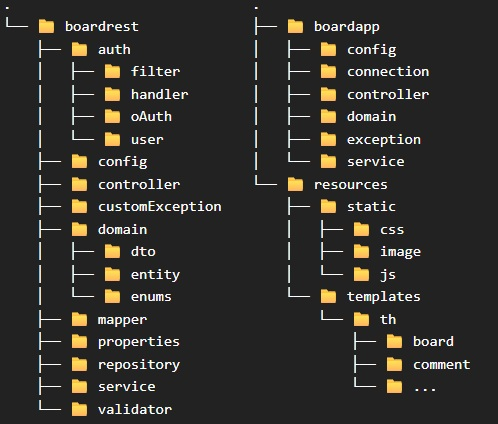
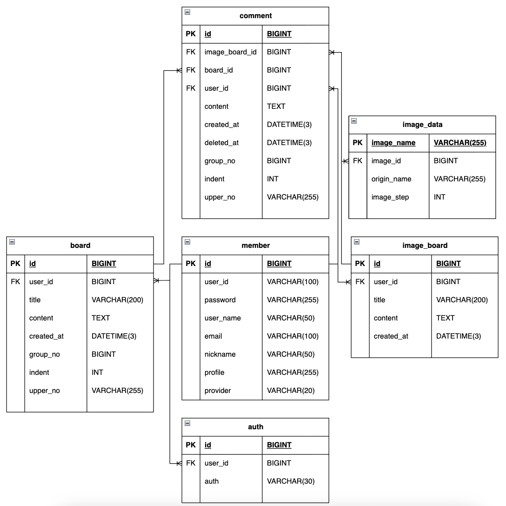

# BoardProject REST API

<br/>
<br/>

## 프로젝트 개요

### 프로젝트 목적
- 프론트엔드와 백엔드가 분리된 환경으로의 서비스 구축
- API 서버와 프론트를 담당하는 View-Centric 서버로 나눠 WebClient 구축 경험 및 데이터 직렬화, 예외 처리 과정 경험 확보

<br/>

### 프로젝트 요약
이 프로젝트는 소규모 커뮤니티 서비스를 직접 기획, 설계하여 새로운 기술 스택을 도입할 때 기준점으로 활용하는 테스트베드입니다.

CRUD, 파일 시스템 관리, 계층형 쿼리 등 백엔드의 핵심 기능을 구현하며 각 환경의 특성을 분석하고 있습니다.   
현재는 React 기반의 공통 프론트엔드를 고정하고, 백엔드를 다양한 언어와 프레임워크로 재구현하며 아키텍처의 유연성을 검증하고 있습니다.


#### 프로젝트 버전
1. Spring MVC & JSP, Oracle (<a href="https://github.com/Youndae/BoardProject">Git Repo Link</a>)
   - 초기 설계 및 파일 관리 비즈니스 로직 확립한 최초 버전입니다.
   - 당시 가장 익숙했던 Spring MVC, JSP 환경을 사용하고 새롭게 Oracle을 사용해보며 MySQL과의 문법 및 동작 차이를 학습했습니다.
   - 설계 당시 주요 과제였던 효율적인 파일 관리 문제를 성공적으로 해결해 구현했습니다. 
2. Servlet & JSP, JDBCTemplate, MySQL (<a href="https://github.com/Youndae/BoardProject_servlet_jsp">Git Repo Link</a>)
   - 프레임워크의 추상화 계층을 제외한 Legacy 환경에서 요청 처리 흐름을 Low-level부터 파악했습니다.
   - JPA나 MyBatis 없이 JDBCTemplate을 직접 제어하며 영속성 계층의 동작 원리와 프레임워크가 제공하는 편의성의 실체를 체감했습니다.
3. REST API & React
   1. 공통 프론트엔드 (<a href="https://github.com/Youndae/boardProject_client_react">Git Repo Link</a>)
      - React(JSX)를 이용한 최초의 SPA 환경 구축 프로젝트입니다.
      - Axios 기반 통신 구조를 설계하고 컴포넌트 단위로 책임을 분리하여 유지보수성을 높였습니다.
      - 분리된 구조를 활용해 다양한 백엔드 스택의 REST API를 테스트하는 범용 프론트엔드로 활용중입니다.
   2. Spring Boot, JPA, MySQL 버전
      - API 서버(board-rest)와 Client 서버(board-app)를 각각 독립적으로 구축했습니다.
      - board-rest(API Server)
        - 서비스의 핵심 비즈니스 로직 및 인증 / 인가를 전담하는 API 서버입니다.
        - JPA를 사용했으며, 데이터를 제공합니다.
      - board-app(View-Centric Server)
        - 자체 DB 없이 WebClient를 사용하여 board-rest와 통신하는 독립 실행 서버입니다.
        - 사용자로부터 받은 인증 정보와 요청을 API 서버로 전달하는 역할을 수행하며, Thymeleaf를 통해 사용자에게 view를 제공합니다.
        - 백엔드와 프론트엔드를 분리해 WebClient로 통신하는 환경 구축을 목적으로 설계하였으며, 서버간 통신 시 발생하는 데이터 직렬화 및 예외 처리 과정을 학습했습니다.
        - React 프론트엔드 구축 이후 리팩토링을 중단한 상태입니다.
   3. Kotlin, Spring Boot 버전 (<a href="https://github.com/Youndae/boardProject_kt">Git Repo Link</a>)
      - Java와 Kotlin의 차이점을 분석하고, data class를 활용한 불변 객체 통제 기법을 학습했습니다.
      - Clean Architecture를 적용하여 도메인 중심 설계를 지향하며, 엄격한 계층 분리가 가져오는 생산성 저하와 같은 실질적인 단점을 분석하고 해결책을 고민했습니다.
   4. Express 버전 (<a href="https://github.com/Youndae/boardproject_ex">Git Repo Link</a>)
      - Spring 환경을 벗어나 Middleware 기반 아키텍처의 빠른 응답 처리와 서비스 레이어의 부담 완화 라는 장점을 확인했습니다.
      - 프레임워크 차원의 트랜잭션 관리 부재로 인해 통합 테스트 시 발생하는 데이터 정합성 관리의 복잡성을 체감했으며, 이를 보완하기 위한 테스트 환경 설계 역량을 키웠습니다.
   5. Nest 버전 (<a href="https://github.com/Youndae/boardproject_nest">Git Repo Link</a>)
      - Module 구조를 통한 체계적인 의존성 관리 방식을 학습했습니다.
      - 의존성 증가에 따라 모듈이 무거워질 수 있다는 단점을 파악하고, 효율적인 모듈 바운더리 설정이 NestJS 설계의 핵심임을 이해했습니다.
      - TypeScript의 엄격한 타입을 통해 Runtime 이전 단계에서의 안정성 확보를 경험했습니다.

<br/>

## 목차
<strong>1. [개발 환경](#개발-환경)</strong>   
<strong>2. [프로젝트 구조 및 설계 원칙](#프로젝트-구조-및-설계-원칙)</strong>   
<strong>3. [ERD](#ERD)</strong>   
<strong>4. [기능 목록](#기능-목록)</strong>   
<string>5. [핵심 기능 및 문제 해결](#핵심-기능-및-문제-해결)</strong>  

<br/>
<br/>

## 개발 환경
|category| Tech Stack|
|---|---|
|Backend| - JDK 8 <br/> - Spring Boot 2.7.6 <br/> - Spring Data JPA <br/> - QueryDSL <br/> - mapstruct |
|Security| - SpringSecurity <br/> - OAuth2 <br/> - JWT|
|Frontend| - React(CRA) <br/> - Redux Toolkit <br/> - Styled Components <br/> - Axios <br/> - React Cookie      |
|View-Centric Server| - web flux <br/> - Thymeleaf <br/> - JQuery|
|Database| - MySQL <br/> - Redis                                                                                |
|Libraries| - Spring Validation <br/> - Thumbnailator|

<br/>

## 프로젝트 구조 및 설계 원칙

1. **공통**   
board-rest와 board-app 모두 Layered Architecture로 설계했으며 service의 경우 interface - impl 구조를 채택했습니다.

2. **board-rest**   
레이어별 패키지 분리를 원칙으로 설계했습니다.   
각 패키지 하위로 도메인들의 클래스들이 위치하며, domain/dto 하위의 경우 내부에서 도메인별로 다시 분리하도록 설계했습니다.   
또한, request, response, business로 추가 분리해 목적에 맞는 DTO별로 분리하는 구조입니다.   

3. **board-app**
board-app의 경우 자체 DB 없이 board-rest에게 요청 전달, 응답 파싱 후 Thymeleaf로 view를 제공하는 역할이기 때문에 단순한 구조로 설계했습니다.   
domain 패키지에서는 요청, 응답 DTO만 존재하며, service는 쿠키 처리, ObjectMapper를 통한 직렬화 등 API 서버 요청 전후 과정의 비즈니스 로직을 처리합니다.   
API 서버와의 통신을 담당하는 패키지로는 connection 패키지이며, 내부에서는 비즈니스 로직을 최소화하고 요청과 응답 파싱의 책임에 집중했습니다.
resources 하위로는 static, templates 패키지를 사용하는 기본적인 Thymeleaf SSR 구조로 설계했습니다.   
templates/th 하위로는 도메인별로 html 파일을 분리했습니다.




<br/>

## ERD



<br/>

## 기능 목록

<details>
    <summary><strong>계층형 게시판</strong></summary>

* 게시글 목록
    * 게시글 검색( 제목, 작성자, 제목 + 내용 )
    * 페이지네이션
    * 계층형 구조
* 게시글 상세
    * 작성자의 게시글 수정, 삭제, 답글 작성
    * 로그인한 사용자의 답글 작성, 댓글 작성
    * 로그인한 사용자의 대댓글 작성
    * 댓글 작성자의 댓글 삭제
    * 댓글 페이지네이션
* 게시글 작성
* 게시글 수정
* 답글 작성
</details>

<br/>

<details>
    <summary><strong>이미지 게시판</strong></summary>

* 게시글 목록
    * 게시글 검색 ( 제목, 작성자, 제목 + 내용 )
    * 페이지네이션
* 게시글 상세
    * 작성자의 게시글 수정, 삭제, 답글 작성
    * 로그인한 사용자의 답글 작성, 댓글 작성
    * 로그인한 사용자의 대댓글 작성
    * 댓글 작성자의 댓글 삭제
    * 댓글 페이지네이션
* 게시글 작성
    * 이미지 파일 업로드(최소 1장 필수. 최대 5장)
    * 텍스트 내용 작성
* 게시글 수정
    * 기존 이미지 파일 삭제
    * 추가 이미지 업로드(기존 파일 포함 최대 5장)
</details>

<br/>
<br/>

## 핵심 기능 및 문제 해결

<br/>

### 목차
1. **[WebClient](#WebClient)**
2. **[로그인](#로그인)**
3. **[이미지-리사이징](#이미지-리사이징)**

<br/>
<br/>

### WebClient

board-app은 Spring boot 환경의 View-Centric 서버이기 때문에 API 서버와 통신하기 위해 WebClient를 사용했습니다.   
최초 설계 당시에는 RestTemplate이라는 선택지도 있었지만, 당시 RestTemplate이 Deprecated 될것이라는 소문도 있었고 Spring에서 공식적으로 WebClient를 권장했기에 WebClient를 채택했습니다.   

기능 자체의 비즈니스 로직은 board-rest에 책임이 있었기 때문에 board-app에서 처리할 비즈니스 로직은 Cookie 생성 및 값 추출, API 서버와 주고 받는 데이터의 직렬화, 역직렬화 등과 같은 로직만 필요했습니다.
이 단계에서 설계에 대해 고민이 많았는데 인프라 계층과 비즈니스 계층의 관심사 분리를 명확히 하는 것이 추후 확장성이나 유지보수 측면에서 유리할 것이라고 생각해 connection 패키지에서 WebClient 요청을 처리, Service에서는 비즈니스 로직만 처리하는 구조를 채택했습니다.   

WebClient 설정은 2가지 설정이 필요했습니다.   
이미지 파일을 포함하고 있는 설정과, 그렇지 않은 설정입니다.   

<details>
    <summary><strong>✔️ WebClientConfig 코드</strong></summary>

```java
@Component
public class WebClientConfig {
    public WebClient useWebClient() {
        return WebClient.builder()
                .baseUrl("http:/localhost:8080")
                .defaultHeader(HttpHeaders.CONTENT_TYPE, MediaType.APPLICATION_JSON_VALUE)
                .build();
    }
    
    public WebClient useImageWebClient() {
        ExchangeStrategies exchangeStrategies = ExchangeStrategies.builder()
                .codecs(clientCodecConfigurer -> clientCodecConfigurer.defaultCodecs()
                        .maxInMemorySize(10 * 1024 * 1024)).build();
        
        return WebClient.builder()
                .baseUrl("http://localhost:8080")
                .defaultHeader(HttpHeaders.CONTENT_TYPE, MediaType.APPLICATION_JSON_VALUE)
                .exchangeStrategies(exchangeStrategies)
                .build();
    }
}
```

</details>

이미지 파일을 같이 보내는 기능이 많지 않지만, 그럼에도 이후 확장성과 설정에 대한 응집도를 고려해 WebClientConfig를 통해 사용하도록 설계했습니다.   
WebClient는 기본적으로 InMemory Buffer 크기를 256KB로 제한하기 때문에 파일 전송 시 발생할 수 있는 DataBufferLimitException을 방지하고,   
백엔드 허용치와 동일한 10MB에 맞춘 메모리 할당을 위해 maxInMemorySize를 설정했습니다.   
이 설정으로 인해 정상적인 파일 전송과 백엔드까지 불필요한 요청이 도달하기 전, View-Centric 서버에서 1차적으로 차단하여 불필요한 네트워크 비용과 서버 리소스 낭비를 방지했습니다.

<details>
    <summary><strong>✔️ WebClient 활용 코드</strong></summary>

```java
public PaginationListDTO<HierarchicalBoardDTO> getList(
        Criteria cri,
        MultiValueMap<String, String> cookieMap,
        HttpServletResponse response
) {
    UriComponentsBuilder ub = uriComponentsService.getListUri(boardPath, cri);
    
    String responseVal = webClient.get()
            .uri(ub.toUriString())
            .cookies(cookies -> cookies.addAll(cookieMap))
            .exchangeToMono(res -> {
                exchangeService.checkExchangeResponse(res, response);
                return res.bodyToMono(String.class);
            })
            .block();
    
    ParameterizedTypeReference<PaginationListDTO<HierarchicalBoardDTO>> typeReference =
            new ParameterizedTypeReference<PaginationListDTO<HierarchicalBoardDTO>>() {};
    
    PaginationListDTO<HierarchicalBoardDTO> dto = readValueService.fromJsonWithPagination(typeReference, responseVal, cri);
    
    return dto;
}
```

</details>

기능 특성상 응답의 정합성을 보장해야 할 필요가 있었기 때문에 WebClient를 사용함에 있어서 blocking 방식을 채택했습니다.   
MSA 환경에서 Reactive Programming을 위해 WebClient를 적극적으로 사용하고 있는것으로 알고 있는데,   
이후 MSA 환경 구축 과정에서 적극적으로 Non-Blocking을 사용해보고자 계획하고 있습니다.

<br/>
<br/>

### 로그인

로그인은 아이디와 비밀번호를 직접 입력하는 로컬 로그인과 Google, Kakao, Naver를 통한 OAuth 로그인이 있습니다.   
모든 인증 성공 시 JWT를 발급합니다.

1. 토큰 관리 방식
- 토큰 종류
    - JWT는 AccessToken과 RefreshToken로 설계했으며 RTR 방식을 채택했습니다
    - 추가로 ino라는 UUID기반 난수값을 발급하며, 이는 디바이스별 다중 로그인을 허용하기 위한 식별자 역할을 수행합니다.
- 토큰 관리
    - 클라이언트에서 모든 토큰, ino는 쿠키로 관리합니다.
    - 백엔드에서는 RDB가 아닌 Redis에서 토큰을 관리하며 AccessToken, RefreshToken만 저장해 관리합니다.
    - Redis Key 구조는 token별 prefix + ino + userId 구조로 설계했습니다.
    - 재발급은 401 TOKEN_EXPIRE를 반환하는것이 아닌 바로 RefreshToken을 검증하고 정상적이라면 즉시 재발급을 수행, 사용자의 요청까지 모두 처리한 뒤 응답 쿠키로 같이 전달하는 방식을 채택했습니다.

2. 로컬 로그인 처리
- Spring Security의 기본 로그인이나 별도의 EndPoint를 Controller에 직접 작성해 처리하는 방식 대신 LoginFilter를 작성해 해당 필터에서 처리합니다.

3. OAuth2 로그인
- 응답 추상화
    - 각 Provider 마다 다른 사용자 정보 규격을 OAuth2Response 인터페이스로 추상화하여 확장성을 확보했습니다.
- Redirect 흐름 개선
    - 기존 프론트엔드에서 화면이 비어있는 컴포넌트인 OAuth.jsx와 SessionStorage를 사용하여 이전 경로로 연결될 수 있도록 처리했습니다. 하지만 이 방식은 인증 완료 후 불필요한 라우팅이 한번 더 발생하는 구조였습니다.
    - 문제 해결을 위해 로그인 요청 시점에 이전 경로를 redirect_to 쿠키에 저장하고 백엔드는 SuccessHandler에서 이를 읽어 Redirect 할 수 있도록 개선했습니다. 이를 통해 프론트엔드에서 불필요한 로직과 라우팅을 제거하고 흐름을 단순화 할 수 있었습니다.

<details>
    <summary><strong>✔️ OAuthResponse 코드</strong></summary>

```java
public interface OAuth2Response {
    String getProvider();
    String getProviderId();
    String getEmail();
    String getName();
}


public class GoogleResponse implements OAuth2Response {
    
    private final Map<String, Object> attribute;
    
    public GoogleResponse(Map<String, Object> attribute) {
        this.attribute = attribute;
    }

    @Override
    public String getProvider() {
        return OAuthProvider.GOOGLE.getKey();
    }

    @Override
    public String getProviderId() {
        return attribute.get("sub").toString();
    }

    @Override
    public String getEmail() {
        return attribute.get("email").toString();
    }

    @Override
    public String getName() {
        return attribute.get("name").toString();
    }
}
```

</details>

<details>
    <summary><strong>✔️ OAuthSuccessHandler 코드</strong></summary>

```java
@Component
@RequiredArgsConstructor
@Slf4j
public class CustomOAuthSuccessHandler extends SimpleUrlAuthenticationSuccessHandler {

    private final JwtTokenProvider tokenProvider;

    private final CookieProperties cookieProperties;

    @Override
    public void onAuthenticationSuccess(HttpServletRequest request, HttpServletResponse response, Authentication authentication) throws IOException, ServletException {
        CustomOAuth2User customOAuth2User = (CustomOAuth2User) authentication.getPrincipal();
        String userId = customOAuth2User.getUserId();
        Collection<? extends GrantedAuthority> authorities = authentication.getAuthorities();
        Iterator<? extends GrantedAuthority> iterator = authorities.iterator();
        GrantedAuthority auth = iterator.next();
        String role = auth.getAuthority();

        Cookie redirectCookie = WebUtils.getCookie(request, "redirect_to");
        String redirectUrl = (redirectCookie != null) ? redirectCookie.getValue() : "/";
        Cookie inoCookie = WebUtils.getCookie(request, cookieProperties.getIno().getHeader());

        if(redirectCookie != null) {
            redirectCookie.setPath("/");
            redirectCookie.setMaxAge(0);
            response.addCookie(redirectCookie);
        }

        if(inoCookie == null)
            tokenProvider.issuedAllToken(userId, response);
        else
            tokenProvider.issuedToken(userId, inoCookie.getValue(), response);

        String targetUrl = (customOAuth2User.getNickname() == null)
                ? "/join/profile?redirect=" + URLEncoder.encode(redirectUrl, "UTF-8")
                : URLDecoder.decode(redirectUrl, StandardCharsets.UTF_8.toString());

        getRedirectStrategy().sendRedirect(request, response, "http://localhost:3000" + targetUrl);
    }
}
```

</details>

<br/>
<br/>

### 이미지 리사이징

이미지 파일의 경우 리사이징 기능을 도입했습니다.   
Thumbnailator 라이브러리를 사용했으며, 300, 600 사이즈로의 리사이징을 수행하도록 설계했습니다.   

Profile 이미지와 이미지 게시판 이미지로 나눠서 처리하게 되며, Profile 이미지는 300 사이즈로 리사이징 이후 원본이 아닌 리사이징된 이미지 파일만 저장합니다.   
profile의 경우 화면에서 크게 보여야 할 이유가 없기 때문에 작은 사이즈만 보관하면 될 것이라고 판단했습니다.   

이미지 게시판의 경우 300, 600 두 사이즈로 리사이징을 진행하게 되며 원본도 같이 저장하는 구조입니다.   
그리고 데이터베이스에는 원본 파일명으로 저장하도록 설계했습니다.
이미지 게시판은 목록에서 기본적으로 300을 사용, 상세 페이지에서는 브라우저 크기에 따라 300에서 600 사이즈까지 조절되어야 하기 때문입니다.   

원본 파일만 데이터베이스에 저장되는 만큼 리사이징 파일명들은 원본 파일명을 기본적으로 따라가도록 설계했습니다.   
원본파일명_300.jpg, 원본파일명_600.jpg 와 같은 구조로 저장합니다.   

<details>
    <summary><strong>✔️ ImageFileService 코드</strong></summary>

```java
@Service
public class ImageFileServiceImpl implements ImageFileService {
    @Value("#{filePath['file.board.path']}")
    private String boardPath;

    @Value("#{filePath['file.profile.path']}")
    private String profilePath;

    private final int MAX_PIXEL = 5000;

    private final int SIZE_300 = 300;

    private final int SIZE_600 = 600;

    private final String EXTENSION = "jpg";
    
    //profile 이미지 처리
    @Override
    public String profileImageSave(MultipartFile file) throws IOException {
        validateResolution(file);
        String saveNamePrefix = createSaveFileName(file).get(SaveImageKey.SAVE_NAME);
        BufferedImage originalImage = ImageIO.read(file.getInputStream());
        return imageResizing(originalImage, saveNamePrefix, SIZE_300, profilePath);
    }
    
    // 이미지 게시판 이미지 처리
    @Override
    public Map<SaveImageKey, String> boardImageSave(MultipartFile file) throws IOException {
        validateResolution(file);
        Map<SaveImageKey, String> saveImageMap = createSaveFileName(file);
        String saveName = saveImageMap.get(SaveImageKey.SAVE_NAME);
        try {
            BufferedImage originalImage = ImageIO.read(file.getInputStream());

            Thumbnails.of(originalImage)
                    .scale(1.0)
                    .outputFormat(EXTENSION)
                    .outputQuality(0.9)
                    .toFile(new File(boardPath + saveName));

            imageResizing(originalImage, saveName, SIZE_300, boardPath);
            imageResizing(originalImage, saveName, SIZE_600, boardPath);

            return saveImageMap;
        }catch (Exception e) {
            if(!saveImageMap.isEmpty())
                cleanupImageBoardFiles(saveImageMap.get(SaveImageKey.SAVE_NAME));

            throw new CustomIOException(ErrorCode.INTERNAL_SERVER_ERROR, ErrorCode.INTERNAL_SERVER_ERROR.getMessage());
        }
    }

    // 리사이징 처리
    private String imageResizing(BufferedImage file, String fileName, int size, String filePath) throws IOException {
        String saveName = createResizeName(fileName, size);

        File targetFile = new File(filePath + saveName);

        Thumbnails.of(file)
                .size(size, size)
                .outputFormat(EXTENSION)
                .outputQuality(0.8)
                .toFile(targetFile);

        return saveName;
    }
    
    // 원본 파일명 생성
    private Map<SaveImageKey, String> createSaveFileName(MultipartFile image) {
        Map<SaveImageKey, String> map = new HashMap<>();

        String originalName = image.getOriginalFilename();
        StringBuffer sb = new StringBuffer();
        String saveName = sb.append(new SimpleDateFormat("yyyyMMddHHmmss")
                        .format(System.currentTimeMillis()))
                .append(UUID.randomUUID())
                .append(".")
                .append(EXTENSION)
                .toString();

        map.put(SaveImageKey.SAVE_NAME, saveName);
        map.put(SaveImageKey.ORIGIN_NAME, originalName);

        return map;
    }

    // 리사이징 파일명 생성
    private String createResizeName(String fileName, int size) {
        String saveNamePrefix = fileName.substring(0, fileName.lastIndexOf('.'));
        String saveName = saveNamePrefix + "_" + size + "." + EXTENSION;

        return saveName;
    }
    
    //...
}
```

</details>

ImageFileService에서는 기본적으로 profile, imageBoard에 따라 접근하는 메서드를 제공하고 세부적인 기능들은 private으로 설계했습니다.   
이미지 게시판의 경우 파일이 여러개 존재하기 때문에 ImageBoardService에서 반복적으로 boardImageSave 메서드를 호출하는 구조입니다.   
파일 저장 처리 도중 예외가 발생했을 때 이미 저장된 파일들은 제거하도록 처리할 필요가 있었기 때문에 하나씩 결과를 반환받고 파일명을 관리할 수 있어야 하기 때문입니다.   
임시 저장소를 사용하지 않고 바로 저장하는 구조 특성상 필요한 작업이었으며, 이번 처리를 통해 임시 저장소의 효율성에 대해 다시 한번 고민하는 기회가 되었습니다.

기본적으로 이미지는 10MB를 넘기지 않도록 처리하고 있지만, 그럼에도 픽셀수가 많아지면 Heap Memory 부족 또는 서버 부하가 발생할 수 있다는 점을 알 수 있었습니다.   
그래서 최초 파일 검증 과정에서 MAX_PIXEL 이상인 경우에는 처리하지 않고 Exception을 발생시키도록 설계했습니다.
원본, 300, 600을 처리하는 다단계 리사이징 과정에서 매번 Disk I/O를 발생시키지 않도록 ImageIO.read()를 통해 원본 이미지를 메모리에 한번만 로드하여 모든 리사이징 프로세스에 재사용함으로써 처리 속도를 최적화했습니다.

